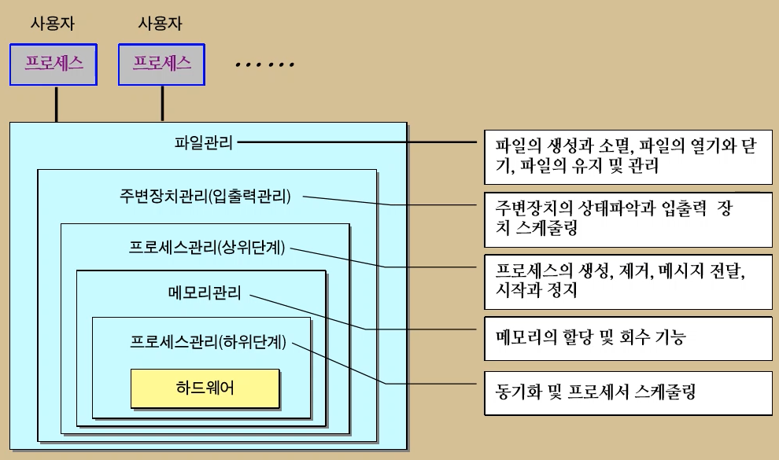

s# 시스템 보안
## 목차
1. [운영체제 이론](#1-운영체제-이론-⬆️목차)
2. [해킹의 개요](#2-해킹의-개요-⬆️목차)
3. [해킹의 기법](#3-해킹의-기법-⬆️목차)

---
## 1. 운영체제 이론 [⬆️](#목차)

### 운영체제의 역할과 목적
>**운영체제 (Operating System, OS)**  
>응용프로그램~HW의 인터페이스이자, 시스템자원(기억장치, 프로세서, 입출력장치, 정보, 네트워크 등)을 효율적으로 관리할 수 있음

>**운영체제의 목적**  
>1. 편리성  
>ex) GUI(Graphic User Interface) → 생산성 기대, MMI(Man-Machine Interface)  
>2. 효율성  
>처리 능력 향상&응답시간 단축 : 단위 시간 내에 최대한 많은 양의 일을 처리 → 멀티 프로그래밍&스레딩  신뢰도 향상(HW(FW)/SW) : 시스템이 정확하게 작동되는 정도  사용가능도(가동률)

### 운영체제의 기능과 구조
>**기능**
>1. 자원 관리
>- 프로세스 관리 : 프로세스 스케줄링을 통해 실행 가능한 프로세스 추적 관리
>- 메모리 관리
>- 주기억장치 관리 : 주기억장치 접근, 주소 변환, 기억 보호, 버퍼 기억  ex) RAM ROM
>- 보조기억장치 관리 : SSD, HD, USB 등의 기억장치에 대한 접근 관리, 제어
>- 파일관리: 파일에 대한 조작, 저장방식, 접근방법에 대한 관리
>>- 주변장치 관리(입출력 관리)  
   >>① 장치 구동기(Device Driver)  
   >>② 데이터의 입출력 방식 : 프로그램에 의한 입출력, 인터럽트, DMA(Direct Memory Access)  
   >>>③ 버퍼링과 스풀링  
   >>>**버퍼링(Buffering)** ~ MEMORY : I/O와 보조기억장치의 처리속도가 CPU의 처리속도보다 느린 문제를 보완하는 방법 중 하나, CPU가 하나의 연산을 시작하면 I/O가 다음에 필요한 레코드를 미리 읽어 주기억장치에 저장함으로써 CPU의 대기시간 절감.
    **스풀링(Spooling)** ~ DISK : 버퍼링과 같은 개념이며, 스풀링은 디스크를 매우 큰 버퍼처럼 사용. ex) 프린터에 RAM이 없는 경우 

>2. 시스템 관리
  시스템 보호(사용자 권한 부여), 네트워크, Command Interpreter

>**구조**

>**커널(Kernel)**
>- HW로부터 프로그램들을 격리시키고, HW와 직접적으로 상호작용함으로써 프로그램들에게 일관된 서비스를 제공.
>-  핵심기능은 프로세스와 파일의 관리이며, 그밖에 I/O 관리, 메모리 관리, 시스템 호출 인터페이스 등을 수행한다.
>- Interupt 수행 ~ 멀티 태스킹 (동시 수행같아 보이지만, 실제로는 Interup를 통한 단일 수행이다.) 

### 운영체제의 기술발전 흐름
>**단순모니터**  
컴퓨터 오퍼레이터가 할 일을 자동으로 수행

>**일괄처리 시스템(Batch Processing System)**  
여러 개의 작업을 단일 작업으로 묶어 일괄처리 하는 시스템 
 보조기억장치의 속도가 느려 처리 시간이 많이 걸림 → 모니터링, 버퍼링, 스풀링 도입

>**다중프로그래밍 시스템**  
I/O와 CPU의 속도 차이에 따른 비효율 문제 개선  
주기억장치 내에 2개 이상의 프로그램을 적재해 그 중 하나가 실행될 경우, 실행 중 I/O 등의 조작으로 CPU가 쉬는 시간이 생기면 OS가 다른 프로그램을 실행.

>**시분할 처리시스템(Time-Sharing System, TSS)**  
프로세스의 사용시간을 분할(Time Slice)해 다중 사용자가 CPU를 순환해 이용

>**분산처리 시스템(Distributed Processing System, DPS)**  
하나의 대형 컴퓨터에서 수행하던 기능을 지역적, 기능적으로 분산된 컴퓨터가 분담해 네트워크를 통해 처리 ~ 자원공유, 계산 속도/신뢰도 향상, 통신 기능

>**다중처리 시스템(Multi Processing System)**  
여러 개의 작업을 하나의 시스템(다수의 CPU)에서 동시에 처리할 수 있는 시스템  
여러 개의 프로세스가 메모리에 저장돼 자원이 할당될 때마다 다시 실행되면서 처리를 완료할 때까지 메모리에 존재하는 시스템

>**실시간 시스템(Real time System)**  
자료가 발생한 지점에서 단말기를 통해 직접 입출력되므로, 사용자의 노력이 절감됨
 → 처리시간 및 비용 단출, 자료가 무작위로 도착하므로 입출력 자료의 일시저장과 대기가 필요  ex) 클라우드 컴퓨팅

### 운영체제의 주요 구성 기술
>**1. 프로세스 관리**   
**프로세스**  
현재 수행 상태에 있는 프로그램으로, 여러 명령어/데이터/카운터/CPU 레지스터/루틴 인자/복귀 주소/저장된 변수 등 데이터 스택 포함   
**프로세스의 상태 변화**  
생성(*new*) : 새로 만들어졌지만, 운영체제에 의해 실행 가능한 프로세스 집합에 포함되지 않은 상태  
준비(*ready*) : 프로세스가 실행되고 있진 않으나, 즉시 CPU를 사용할 수 있는 대기 상태  
실행(*running*) : 현재 CPU를 차지해 동작중인 상태  
대기(*waiting*) : 어떤 이벤트가 발생하기 전까지는 실행될 수 없는 상태  
보류(*terminated*) : 프로세스가 디스크 등에 보관돼 있는 상태  
교착(*suspend*) : 결코 일어날 수 없는 사건을 기다리는 상태  
종료(*exit*) : OS에 의해 프로세스 집합에서 해제된 상태   
**프로세스 제어 블록 (Process Control Block, PCB)**  
운영 체제가 프로세스에 대한 중요한 정보를 저장한 저장소  
운영체제는 프로세스의 실행 중단 시, 중단 후 재실행 시 등의 경우에 PCB를 참조   
**스레드와 태스크**  
스레드(*Tread*) : 스레드는 프로세스를 수행하는 데 필요한 가능한 많은 하위 작업들 중 하나 (프로세스보다 작은 단위로, 프로세스 스케줄링의 단위가 됨)  
태스크(*Task*) : 자원 할당의 단위로 프로세스와 같은 개념 ~ Linux (프로세스는 Windows)  
>**프로세스 vs 스레드 vs 태스크**   
**프로세스 스케줄링**  
멀티 프로세스 시스템에서 CPU를 사용하는 프로세스 결정 문제  
~ 스와핑(*Swapping*) : 메모리에서 프로세스를 제거하는 것이 효율적인 경우, 프로세스를 제거했다가 이 프로세스를 다시 호출해 중단되었던 지점부터 실행을 재개  
① 장기 스케줄링 : 어떤 프로세스를 커널에 등록할 것인지를 결정  
② 중기 스케줄링 : 어떤 프로세스에게 메모리를 할당할 것인지를 결정  
③ 단기 스케줄링 : 어떤 프로세스에게 CPU를 할당할 것인지를 결정   
**스케줄링 알고리즘**  
기준 : CPU 알고리즘, 시스템 처리율, 반환 시간, 대기 시간, 응답 시간  
종류 : FIFO, SJF(*Short Job First*), SRT(*Shortest Remaining Time*), *Priority*, *Round-Robin*, *Multilevel Feedback* 등   
**프로세스 간 협조**
>> 생산자와 소비자 문제 (Bounded-Buffer Problem)
>> - 여러 개의 프로세스 동기화 문제
>> - 생산자와 프로세스 소비자 프로세스가 공유하는 버퍼 이요에 따른 동기화
>> - 해결 방법 : 생산자~소비자 협동, 세마포어(*Semaphore*) 등

>> 임계영역 문제 (Critical Section Problem)
>> - 멀티스레드 또는 멀티프로세스 시 공유하는 변수, 파일, 테이블 등의 동시 변경에 따라 상호 모순이 발생하는 문제
>> - 해결 방법 : 상호배제(*하나의 프로세스가 임계영역에 있으면, 다른 프로세스 출입 금지*), 진행(*Progress, 임계영역에 프로세스가 없을 때 임계영역에 들어가려는 프로세스 순서 경정*), 한계 대기(*Bounded Waiting, 한 번 임계영역에 들어간 프로세스가 다음에 임계영역에 들어갈 때 제한을 둠*)

>**프로세스간 통신**  
공유 메모리 방식 : 공유 변수를 통해 정보를 교환하며, OS는 개발자에게 공유 메모리만을 제공  
메시지 시스템 방식 : 프로세스들이 메시지를 교환하도록 허용하는 기법   
**교착상태 (Dead lock 또는 Suspend)**  
다중 프로그래밍 시스템 아래 서로 다른 프로세스가 일어날 수 없는 사건을 무한정 기다리며 더 이상 진행하지 못하는 상태 (Circular wait)  
교착상태 발생 조건 : 상호 배제(*동시에 여러 프로세스 사용불가*), 점유와 대기(*다른 자원을 점유하면서 자신에게 할당된 자원 미해제*), 비중단 조건(*프로세스에 할당된 자원을 끝날 때까지 해제 불가시 = 비선점*), 순환 대기(*Circular wait*)  
교착상태 해결 방법 : 예방(*교착상태 발생 조건이 모두 성립되지 않도록 하는 방법*), 회피(*교착상태 발생 조건 중 일부는 성립될 수 있으나, 교착상태를 발생하지 않도록 하는 방법*), 탐지(*교착상태 발생을 허용하고, 발생 시 이를 발견해 원인 규명*), 복구(*교착상태 발견 후, 순환대기를 제거하거나 자원을 중단*)  

>**2. 기억장치 관리**   
**계층적 기억장치 구조**  
보조 기억장치 / 주 기억장치 / 캐시 기억장치 (CPU 내 존재)  
반입정책(*Fetch*) : ① 요구반입정책(*Demand Fetch Strategic*) ② 예상반입정책(*Anticipatory Fetch Strategic*)  
배치정책(*Placement*) ~ 메모리 할당 기법 : 최초 적합(*First-fit*), 최적 적합(*Best-fit*), 최악 적합(*Worst-fit*)  
교체정책(*Replacement*)   
**메모리 단편화 문제**  
기억장치 관리에서 각 작업에 필요한 기억장치 공간들을 계속적으로 할당 및 회수를 반복할 때, 주 기억장치 중에서 실제로 작업에 사용되지 않고, 유용하게 사용할 수도 없는 공간(단편화)이 발생하는 문제  
~ 내부 단편화(할당된 장소 내), 외부 단편화(작업 분할 영역)  
→ 해결방법
>>**압축** : 산재한 기억장소를 한 군데로 모아 최대의 연속된 빈 공간을 확보  
>>**페이징** : 주소공간을 페이지 단위로 나누고, 실제 주소공간은 페이지 크기와 같은 페이지 프레임으로 나누어 사용  
>>**세그먼테이션** : 세그먼트(*프로그램의 논리적 단위가 되는 프로그램의 모듈이나 자료구조*), 세그먼테이션은 가변분할기법으로 프로세스의 주소공간을 동적으로 설정되는 가변크기의 블록들로 변환해 사용하는 것*) 등

>**주기억장치 할당 기법**  
① 연속할당 기법 : 프로그램을 주기억장치에 연속을 할당하는 기법 (단일분할, 다중분할 할당)  
② 분산할당 기법 : 프로그램을 특정 단위의 조각으로 나누어 주기억장치 내에 분산하여 할당하는 기법 (페이징기법, 세그먼테이션 기법 ~ 둘 다 분산할당 기법)  
③ 단일분할 할당 기법 : Boundary Register 사용  
④ Overlay  
⑤ Swapping : 주기억장치→보조기억장치(*Swap Out*), 보조기억장치→주기억장치(*Swap In*)  
⑥ 다중분할할당기법 : 고정분할할당(*고정된 크기로 분할 → 주기억장치의 낭비가 많다, 실행될 프로그램의 크기를 미리 알아야 한다*), 가변분할할당(*고정분할할당의 단편화를 줄이기 위한 방법*)

>**가상기억장치(virtual memory)**  
물리적 기억장치의 효율을 위해 논리적으로 확장된 기억장치를 제공하는 기법  
① 요구 페이징 (*Demand paging*) : 실행할 프로그램 일부만 메모리에 적재하는 것, 프로그램의 순차성, 실행 시 일부만 사용  
② 페이징 교체 알고리즘 : FIFO, LRU(*Least Recently Used*), OPT(*OPTimal*), Clock  
③ 스래슁 (*Trashing*) : 페이지 교체 시 페이지 부재가 너무 많이 발생해 CPU의 활용도를 떨어뜨리는 현상

>**디스크와 디스크 스케줄링**  
디스크 공간 할당 기법 : 연속 할당, 연결 할당, 인덱스 할당  
디스크 스케줄링 기법 : 다수의 사용자가 서로 다른 작업을 처리하기 위해 디스크의 입출력을 요구할 때보다 효율적으로 요청을 처리하기 위한 것 
>> FCFS(First Come First Service)  
>> SSTF(Shortest Seek Time First) : 준비상태 큐에 올라운 트랙 중 현재 헤드가 위치한 트랙에서 가장 가까운 요청을 먼저 처리  
>> SCAN : SSTF와 같은 동작을 하지만, 진행 방향 상 가장 가까운 거리에 있는 요청을 먼저 처리  
>> C-SCAN : SCAN과 유사하지만, 헤드가 항상 바깥쪽에서 안쪽으로 이동하면서 가장 가까운 거리에 있는 요청을 서비스함.

>**파일 시스템 관리**  
파일과 파일 구조  
>> 파일 : 서로 연관성 있는 데이터의 집단
>> 파일의 구조 : 파일을 구성하는 레코드들이 기억장치에 배치되는 방식
>>>순차 파일 : 물리적 순서에 따라 저장 (자기 테이프, 종이 테이프, 프린트 출력 등)  
>>>인덱스된 순차 파일 : 키 값에 따라 논리적인 순서대로 배열  
>>>직접 파일 : 레코드가 직접 액세스 기억장치의 물리적 주소를 통해 직접 액세스

>디렉토리와 디렉토리 구조
>> 디렉토리 : 레코드 각 필드에 대한 배열을 보관하는 파일로, 한 파일 내 레코드의 배치 상황을 서술한 곳. 파일 탐색을 위한 색이인이며, 제어 프로그램을 참도죄면 파일의 명칭, 위치, 날자 등이 저장돼 파일 관리의 중심이 됨
>>> 디렉토리 구조 
>>>>1단계 디레토리 : 모든 파일이 같은 디렉토리, 파일 이름을 구분 필요.
>>>>2단계 디렉토리 : 각 사용자마다 별도의 사용자 파일 디렉토리, 부팅시 마스터 파일 디렉토리(MFD)가 먼저 산책(부팅시 마스터)
 

### 운영체제별 주요 특징
**Unix**  
특징  
1. 대화식 운영체제(Shell) : Shell 프롬프트를 통한 명령어 전달 및 명령어 해석기(Shell)에 의한 명령어 처리 및 오류 탐지
2. 멀티태스킹 : 여러 개의 명령어 동시 처리
3. 멀티유저환경 : 여러 사용자가 시스템을 동시에 사용
4. 계층적 파일 시스템 : 트리 구조의 디렉토리
5. 이식성(Portability) : 하드웨어의 종류에 상관 없이 운영
6. 유연성 : 다양한 기종의 장비 간의 통신 시 자료의 손상이 적고, 편리함
7. 호환성 : 타기종에서도 자유롭게 사용 가능
8. 입출력 방향 전환 및 파이프 기능 : 리디렉션 등과 같이 표준 입출력의 재지정 가능, 다수의 명령어를 연결해 다른 명령어의 입력값으로 지정
9. 보안 및 보호 기능

버전 
1. BSD(Berkeley Software Distribution)
2. SVR(System V Release)

종류 : AIX, SunOS(Solaris), IRIX, DEC UNIX, HP UX 등

**Windows**  
특징 (제어 / 자원관리 / 응용프로그램 장치 관리)  
1. GUI 환경
2. Plug & Play : 하드웨어 추가시, 자동 인식하여 환경설정
3. 단축 아이콘 / 바로가기
4. 멀티태스킹 : ①멀티프로그래밍 ②시분할 방식 ③실시간 시스템 방식
5. OLE(Object Linking Embedding) : 개체연결포함 기능 (MS에서 개발)
6. 멀티미디어 기능 향상
7. 네트워크 기능 향상 : 네트워크 설치, 네트워크 공유가 편리함
8. 다중 모니터 지원
9. 정보의 전송 통합 : 클립보드

**Linux**  
특징 (NOS, Network Operating System)   
1. 오픈소스 운영체제
2. 다중 사용자 환경
3. 다중작업 및 가상 터미널 환경
4. GUI 방식의 X윈도우
5. CPU와 무관한 운영체제
6. 강력한 네트워크 환경
7. 다양한 드라이브 지원

버전
1. Red hat ~ 페도라, 센토스OS
2. Debian ~ ubuntu

---
## 2. 해킹의 개요 [⬆️](#목차)

### 해킹의 정의
**컴퓨터나 네트워크의 취약점을 이용해 불법적으로 접근하거나 시스템에 유해한 영향을 끼치는 행위**

### 해킹의 원리
**컴퓨터나 네트워크는 허가받지 않는 제 3자가 불법적으로 접근할 수 있는 취약점이 존재할 수 있으며, 해킹은 이를 이용함**  
~ 시스템 오류에 의한 취약점, 보안취약점

### 공격의 종류
**소극적 공격**  도청, 모니터링 등 (Sniffing)  
**적극적 공격**  명의 도용, 정보삽입 및 수정, 서비스 부인 등 

### 해킹의 개념
**해킹 프로세스**  

>**Unknown Attack**(Zero day)  

>**APT(*Advanced Persistent Threat*)** ~ Target(Whale Fishing)  
>1. 정보수집
>2. 침입
>3. C2 통신
>4. 확산
>5. 데이터 접근
>6. 데이터 유출 or 파괴  

>*공격 전*  
>정찰  
>무기화 및 전달  

>*공격 시도*  
>악용과 설치 (Exploitation)  

>*공격 후*  
>명령과 제어 (C2)
>탈출

**기본 정보수집**  
> *기본 정보수집의 의미*  
>  모든 공격과정의 기본이 되는 단계로 수집된 기본정보의 수준에 따라 표적 시스템의 구체적 대상이나 공격방법이 결정  
> 공격자는 표적에 대한 직접 공격이나 우회공격을 할 수도 있기 때문에 표적 시스템 및 이를 포함한 네트워크 정보까지 수집함

>*기본 정보수집의 범위*  
>표적 시스템에 대한 OS 및 구동 서비스 정보  
>표적 시스템 까지의 경로 및 방화벽 등 보안장비 운영 유무

>*기본 정보수집의 대표적인 방법*  
>웹사이트, Whois, 다양한 명령어(nslookup, 디폴트 배너), 사회공학적 방법, 워다이얼링(Wardialing), 스캔

**스캐닝**  
>*스캐닝의 개요*  
>표적이 되는 대상 시스템 및 네트워크의 정보를 도구를 사용해 탐색하는 것

>*스캐닝의 종류*  
>1. 호스트 스캐닝 ~ **ICMP(Internet Control Message Protocol) 스캐닝** : 인터넷 상의 호스트들에게 제어 메시지를 송신하도록 하여, 전송상의 에러나 예상치 못한 환경에 대한 정보를 제공할 목적으로 만들어진 프로토콜 (ping, ping sweep)    
① Echo Request (type 8) + Echo Reply (type 0)  
② Time Stampt Request (type 13) + Time stampt Reply (type 14)  
③ Information Request (type 15) + Information Reply (type 16)  
④ ICMP Address Mask Request (type 17) + ICMP Address Mask Reply (type 18)
>2. 포트 스캐닝 ~  
>**TCP 스캐닝**  
>SYN(Full) 스캐닝 : 3-way handshaking  
>스텔스 스캐닝: TCP half-open 스캔(SYN/ACK에 대해 close 신호), SYN/ACK 스캔(SYN/ACK 신호 송신), FIN, NULL, X-mas  
>**UDP 스캐닝**  

>*워다디얼링(Wardialing)*

---
## 3. 해킹의 기법 [⬆️](#목차)

### ① 계정 크랙 공격 ~ 여전히 취약
**무차별 공격(Brute Force Attack)** 시스템 또는 서비스의 ID, 패스워드에 대해서 도구를 이요해 ID, 패스워드를 자동 조합해 크랙하는 공격

**사전 공격(Dictionary Attack)** 시스템 또는 서비스의 ID, 패스워드에 대해서 도구를 이용해 ID, 패스워드를 크랙하기 위해 ID와 패스워드가 될 가능성이 있는 단어들을 사전 파일로 만들어놓고 이 사전 파일의 단어를 대입해 크랙하는 공격

### ② 시스템 오류를 이용한 공격
**버퍼 오버플로우(Buffer overflow) 공격** 메모리에 할당된 버퍼의 양을 초과하는 데이터를 입력해 프로그램의 복귀 주소를 조작함으로써 해커가 원하는 코드를 실행하는 공격 ~ 스택 오버플로우, 힙 오버플로우 

**포맷 스트링(Format String) 공격** 포맷 함수(ex: printf 함수)에서 인자 사용의 오류를 이용해 메모리의 내용을 변조하는 공격

→ 솔루션 : ASLR

### ③ 네트워크 공격
**스니핑(Sniffing)** 네트워크 상의 패킷을 도청하는 행위로 암호화 되지 않은 펑문은 스니핑 공격에 매우 취약함  
~ Switch Jamming : 위조된 MAC 주소를 스위치 허브에 보내 주소 테이블을 오버플로우 시킴.  
~ ARP Redirection : 공격자 호스트가 게이트웨이로 가장하여 ARP reply를 네트워크에 주기적으로 보냄으로써 모든 호스트는 공격자에게 패킷을 전송  
~ ICMP Redirect : 위조된 ICMP Redirect 메시지를 보내 공격자의 호스트를 라우터로 인식하도록 하여 패킷을 스니핑

**스푸핑(Spoofing)** 자기 자신의 식별 정보를 속여서 서로 다른 대상 시스템을 공격하는 기법  
~ IP Spoofing : IP 주소를 속여서 다른 시스템을 공격 (*Proxy Server*) 
~ ARP Spoofing : ARP 테이블 상의 정보를 위조해 공격대상 컴퓨터와 서버 사이의 정보 우회(MAC 위조)  
~ E-mail Spoofing : 이메일 발송 시 송신자의 이메일 주소 위조  
~ WEB Spoofing : MITM(*Man in the Middle*) 공격  
~ DNS Spoofing : DNS 서버를 장악해 사용자가 요청하는 DNS 쿼리를 공격자가 원하는 주소로 안내하도록 위조  
~ DHCP Spoofing : DHCP 프로토콜이 제공하는 정보를 변조해 대상 클라이언트 PC를 속이는 공격방법 (*Dynamic Host Configuration Protocol*)

**세션 하이재킹(Session Hijacking)** 상대방의 세션을 가로채는 지능적인 공격 기법  
~ TCP Session Hijacking : IP Spoofing과 스니핑 기법을 이용해 다른 사용자의 텔넷 세션을 가로챔  
~ WEB Sesiion Hijacking : 쿠키 변조를 활용한 Cookie Poisoning

→ 솔루션 : ① Desynchronized 상태 탐지  ② Ack storm 상태 탐지 특정  ③ 세션에서 패킷 유실 및 재전송 증가 탐지 ④ 예상 밖의 접속 Reset → 결국 암호화가 가장 효율적

**서비스 거부 공격(*Denial of Service, DoS*)** 과도한 패킷 트래픽을 발생시켜서 시스템의 중요한 자원을 완전히 소진시킴으로써 시스템의 가용성을 침해하는 행위  
~ Ping of Death : Ping은 최고 65,535byte로 크기가 제한되어 있으나 공격자가 이를 초과하는 큰 크기의 패킷을 보내 시스템 교착상태를 유발  
~ TearDrop Attack(= IP Fragment Packet Flooding) : IP 패킷 전송 시 분할과 재조합의 약점을 이용해 패킷 전송 시 offest을 조작해 시스템 교착상태 유발  
~ SYN Floods : 대상 시스템에 연속적인 SYN을 보내 대기 큐를 넘치게 하여 시스템을 사용하지 못하도록 공격  
~ Smurf Attack(ICMP echo reply complifier) : 공격대상 IP주소로 가장해 수많은 시스템에 ICMP 패킷 송신 시, 공격대상 호스트는 수많은 응답 패킷 수신으로 서비스 불능  
~ Land Attack : 출발지와 목적지의 IP주소, MAC 주소 동일로 무한루프

>**NIP Amplification DDoS/DoS** ~ IP Spoofing  
>**Memcashed Reflection DDoS/DoS** ~ IP Spoofing

### ④ 기타 용어
**피기백(Piggybacking)** 사회공학적 기법  
**레이스 컨디션** 바꿔치기 기법  
**살라미**  
**논리 폭탄** 프로그램 오류 발생 
**트랩도어**  
**백도어**  
**피싱(*Phishing*)** 신뢰할만한 사이트로 믿게끔 위조사이트를 제작 후, 접속을 유도해 정보를 수집  
**파밍(*Pharming*)** 공식적으로 운영되는 도메인 장치를 중간에 탈취해 사용자는 정상적인 웹주소를 입력해도 공격자가 위조한 도메인으로 연결  
**스미싱(*Smishing*)** SMS + Phishing  
**스피어 피싱(*Spear Phishing = Whale Phising*)**   
**Covert Channel(=Lampson)**  
**스캔(Business Scan)** 기업이 거래처와 주고받은 이메일 정보를 해킹/감청/도청해서 거래처로 가장해 무역 거래 대금을 가로채는 범죄 

### ⑤ 애플리케이션 취약점을 이용한 공격
**웹 어플리케이션**

**일반 어플리케이션**

**서버**

**DB 취약점을 이용한 공격**

### ⑥ 사회공학적 공격

 