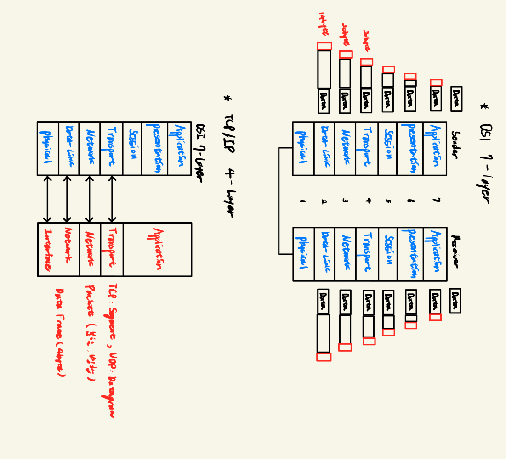

## 네트워크 이론

### OSI 7계층 & TCP/IP 4계층 레이아웃

  

### OSI 7 계층 (Open Systems Interconnection Reference Model, OSI 7 Layer)

프로토콜을 몇 개의 계층으로 나누어 통신기능의 확장을 쉽게 한다. OSI 참조 모델의 **각 계층들은 서로 독립적**이므로 한 계층의 변경사항이 다른 계층에 영향을 미치지 않는다. 

 

1. 물리 계층 (Physical Layer)  
물리 계층은 허브, 라우터, LAN카드, 케이블 등 **전송 매체를 통해 비트를 전송**하며, 상위 계층인 **데이터 링크 계층에서 형성된 데이터프레임을 전기 신호나 광신호로 바꾸어 송수신**한다(by LAN카드).  

- **기계적 특성**  
시스템과 주변장치를 연결하기 위해 정의되며, 물리적 접속에 필요한 커넥터의 모양, 내부의 핀 수, 각 핀의 위치 등을 정의한다.
- **전기적 특성**  
두 시스템 간 접속 회로의 출력/전원 전압, 이진수의 논리적 표현을 정의한다.
- **기능적 특성**  
데이터, 제어, 타이밍, 접지 및 절차를 정의한다.
- **절차적 특성**  
데이터 전송에 필요한 순서를 정의하며, 동작 종료의 절차/물리 연결의 활성화 및 비활성화를 정의한다.
- **네트워크 접속장치**  
**리피터**는 신호의 세기가 약해질 때 전기신호를 복원하고 증폭한다(요즘은 안씀). **허브**(일명 더미허브)는 통신할 수 있는 **포트가 여러 개**이고, 리피터와 마찬가지로 일그러진 전기신호를 복원하고 증폭한다. 

2. 데이터 링크 계층 (Data-Link Layer)  
물리적 링크를 이용해 데이터를 전송하는 계층으로, 데이터 링크계층에서는 **비트를 (데이터)프레임**이라는 단위로 구성한다. 즉 전송하려는 **데이터에 인접한 노드의 주소(최종 수신지가 아닌 다음 노드의 주소)가** 더해진다. 

- **데이터 링크 계층의 특성**  
데이터 링크 계층은 시스템 간 오류가 없도록 데이터를 전송하기 위해, **네트워크 계층으로부터 받은 패킷을 (데이터)프레임으로 구성(주소, 제어정보 등의 비트를 헤더와 트레일러에 추가)해** 물리 계층으로 전송한다. 

- **데이터 링크 계층의 기능**  
**주소 지정** : 데이터 링크 계층에서 추가된 **헤더와 트레일러**에는 **가장 최근에 데이터가 지나온 노드(시스템)와 다음에 접근할 노드의 물리주소가 포함**된다.  
**순서 제어** : 데이터를 순차적으로 전송하기 위해 **프레임에 번호를 부여**한다. **수신 노드에 식별 번호를 추가해 프레임의 순서를 제어**한다.  
**흐름 제어** : 한 번에 전송할 수 있는 데이터양을 조절하고, 연속으로 프레임을 보낼 대 수신 여부를 확인한다.  
**오류 처리** : 오류 검출과 정정 기능 및 오류가 발생한 프레임의 재전송을 요구한다.  
**프레임** : 데이터를 전송할 때 처리가 쉽도록 **프레임 단위로 전송**한다.  
**동기화** : **헤더**에는 **수신 측에 프레임이 도착했음을 알리는 비트**가 있고, **트레일러**에는 **프레임의 끝을 나타내는 비트**와 **오류를 제어하는 비트** 등이 있다.  

- **데이터 링크 계층의 규칙**  
**이더넷** : LAN에세 일반적으로 사용되는 프로토콜은 **이더넷**으로, **이더넷 헤더**는 **송신/수신지 MAC주소(6byte X2), 유형(2byte)으로 총 14byte로 구성**된다. **(이더넷)유형은 이더넷으로 전송되는 상위 계층 프로토콜의 종류**를 말한다. 데이터 뒤에 추가하는 **트레일러**(**FCS, Frame Check Sequence**)는 데이터 송신 도중에 **오류가 발생하는지 확인하는 용도**로 사용한다.  

- **프로토콜을 식별하는 (이더넷)유형 - 16진수**  

유형 번호|프로토콜
:---:|:---:
`0800`|IPv4
`0806`|ARP
`8035`|RARP
`814C`|SNMP over Ethernet
`86DD`|IPv6

- **이더넷 데이터 전송 규칙**  
LAN환경에서는 특정 컴퓨터 한 대에 데이터를 전송하려 해도 나머지 컴퓨터에도 전기신호가 전달된다(**브로드캐스트 방식**). 따라서 데이터에 수신지 정보를 추가해서 전송하고(**수신지 MAC주소를 연결된 컴퓨터들이 확인**), **수신지 이외의 컴퓨터는 데이터를 받더라도 무시한다**.  
여러 컴퓨터가 동시에 데이터를 전송하면 데이터가 충돌할 수 있는데, **이더넷은 여러 데이터가 동시에 케이블을 지날 때 충돌이 발생하지 않도록 데이터를 전송하는 시점을 늦춘다(CSMA/CD방식)**. 그러나 최근에는 효율이 좋지 않은 이유로 스위치를 사용하고 있다.  
``CSMA/CD(Carrier-Sense Multiple Access / Carrier-Sense Collision Detection)``

3. 네트워크 계층 (Network Layer)  
`호스트` : 인터넷에 연결된 컴퓨터(시스템)

- **TCP/IP 프로토콜의 계층**  

계층|프로토콜
:---:|:---:
**응용 계층**|`FTP`, `텔넷`, `SMTP`, `DNS`, `DHCP`
**전송 계층**|`TCP`, `UDP`
**네트워크 계층**|`IP`, `ARP`, `ICMP`, `IGMP`
**네트워크 접속 계층**|`이더넷`, `802.11X`, `MAC/LLC` 등

- **TCP/IP에서 사용하는 주소**  
**물리 주소(MAC)** : 물리 주소(MAC 주소)는 통신망에서 정의된 노드의 주소, **이더넷 네트워크 인터페이스 카드(NIC) 6byte(48bit) 주소를 말한다.  
**인터넷 주소(IP)** : 인터넷에서는 물리 주소와는 별도로 **호스트를 식별할 수 있는 유일한 주소**를 지정한다. 4byte(32bit) 주소 체계를 이용하며, 중복해서 사용할 수 없다.  
**포트 주소** : 동시에 발생하는 프로세스를 처리하려면 **각 프로세스를 식별할 방법**이 필요하다. 즉 **프로세스 식별 주소**(=**포트 주소, 해당 호스트에서 접근하려는 서비스**)를 사용하며, TCP/IP 포트 주소의 길이는 2byte(16bit)이다.

- **라우터**  
네트워크 계층을 통해 다른 네트워크로 데이터를 전송하려면 라우터라는 네트워크 접속장치를 이용한다. **라우터는 데이터를 전송할 수신지가 정해지면 수신지 컴퓨터까지 어떤 경로가 최적인지 알려주는 기능**을 한다. **수신지 컴퓨터의 IP주소 까지 어떤 경로로 데이터를 전송할지 결정하는 것을 라우팅**이라고 한다. (네트워크를 식별하기 위해 수신지 IP주소를 반드시 알아야 한다)

4. 전송 계층 (Transport Layer)

 

5. 세션 계층 (Session Layer)

 

6. 표현 계층 (Presentation Layer)

 

7. 응용 계층 (Applicaiton Layer)

 

### TCP/IP 4 계층 (Transmission Control Protocol/Internet Protocol, TCP/IP 4 Layer)

현재는 대부분 TCP/IP 모델을 사용하며, 주로 하나의 네트워크나 다른 네트워크의 송신지에서 수신지까지의 데이터를 주고받는다.

1. 네트워크 인터페이스 계층 (Network-Interface Layer)

2. 네트워크 계층 (Network Layer)

3. 전송 계층 (Transport Layer)

4. 응용 계층 (Applicaiton Layer)