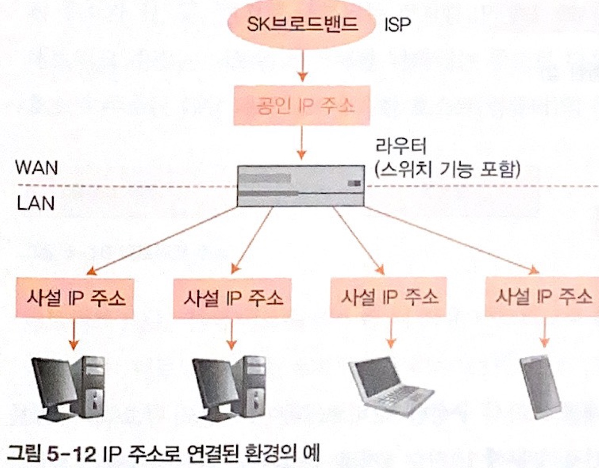
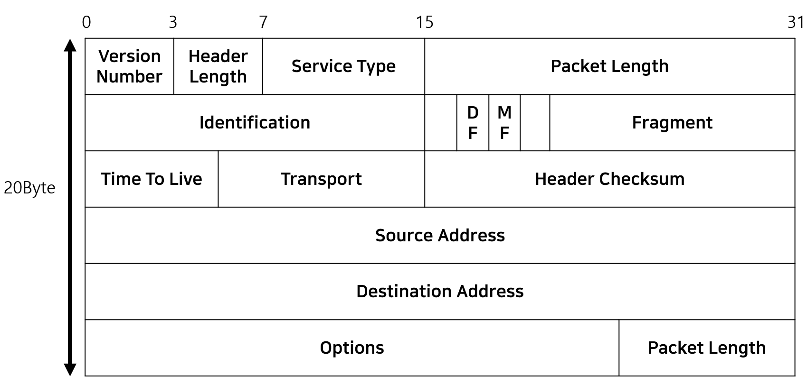
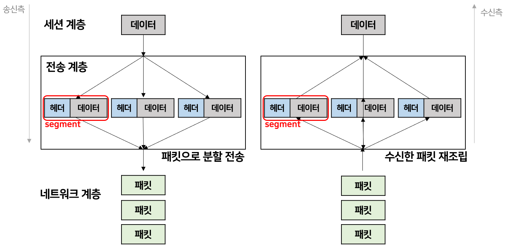
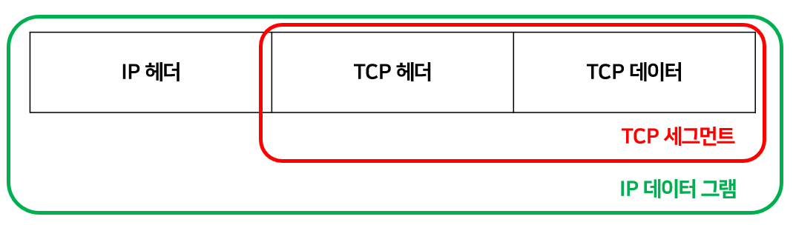
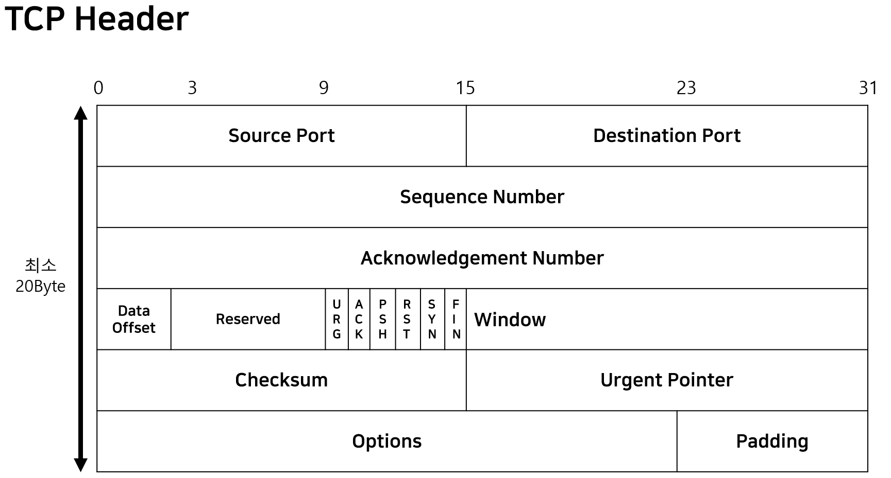

## 네트워크 이론

### OSI 7계층 & TCP/IP 4계층 레이아웃

  

### OSI 7 계층 (Open Systems Interconnection Reference Model, OSI 7 Layer)

프로토콜을 몇 개의 계층으로 나누어 통신기능의 확장을 쉽게 한다. OSI 참조 모델의 **각 계층들은 서로 독립적**이므로 한 계층의 변경사항이 다른 계층에 영향을 미치지 않는다. 

 

1. 물리 계층 (Physical Layer)  
물리 계층은 허브, 라우터, LAN카드, 케이블 등 **전송 매체를 통해 비트를 전송**하며, 상위 계층인 **데이터 링크 계층에서 형성된 데이터프레임을 전기 신호나 광신호로 바꾸어 송수신**한다(by LAN카드).  

- **기계적 특성**  
시스템과 주변장치를 연결하기 위해 정의되며, 물리적 접속에 필요한 커넥터의 모양, 내부의 핀 수, 각 핀의 위치 등을 정의한다.
- **전기적 특성**  
두 시스템 간 접속 회로의 출력/전원 전압, 이진수의 논리적 표현을 정의한다.
- **기능적 특성**  
데이터, 제어, 타이밍, 접지 및 절차를 정의한다.
- **절차적 특성**  
데이터 전송에 필요한 순서를 정의하며, 동작 종료의 절차/물리 연결의 활성화 및 비활성화를 정의한다.
- **네트워크 접속장치**  
**리피터**는 신호의 세기가 약해질 때 전기신호를 복원하고 증폭한다(요즘은 안씀). **허브**(일명 더미허브)는 통신할 수 있는 **포트가 여러 개**이고, 리피터와 마찬가지로 일그러진 전기신호를 복원하고 증폭한다. 

2. 데이터 링크 계층 (Data-Link Layer)  
물리적 링크를 이용해 데이터를 전송하는 계층으로, 데이터 링크계층에서는 **비트를 (데이터)프레임**이라는 단위로 구성한다. 즉 전송하려는 **데이터에 인접한 노드의 주소(최종 수신지가 아닌 다음 노드의 주소)가** 더해진다. 

- **데이터 링크 계층의 특성**  
데이터 링크 계층은 시스템 간 오류가 없도록 데이터를 전송하기 위해, **네트워크 계층으로부터 받은 패킷을 (데이터)프레임으로 구성(주소, 제어정보 등의 비트를 헤더와 트레일러에 추가)해** 물리 계층으로 전송한다. 

- **데이터 링크 계층의 기능**  
**주소 지정** : 데이터 링크 계층에서 추가된 **헤더와 트레일러**에는 **가장 최근에 데이터가 지나온 노드(시스템)와 다음에 접근할 노드의 물리주소가 포함**된다.  
**순서 제어** : 데이터를 순차적으로 전송하기 위해 **프레임에 번호를 부여**한다. **수신 노드에 식별 번호를 추가해 프레임의 순서를 제어**한다.  
**흐름 제어** : 한 번에 전송할 수 있는 데이터양을 조절하고, 연속으로 프레임을 보낼 대 수신 여부를 확인한다.  
**오류 처리** : 오류 검출과 정정 기능 및 오류가 발생한 프레임의 재전송을 요구한다.  
**프레임** : 데이터를 전송할 때 처리가 쉽도록 **프레임 단위로 전송**한다.  
**동기화** : **헤더**에는 **수신 측에 프레임이 도착했음을 알리는 비트**가 있고, **트레일러**에는 **프레임의 끝을 나타내는 비트**와 **오류를 제어하는 비트** 등이 있다.  

- **데이터 링크 계층의 규칙**  
**이더넷** : LAN에세 일반적으로 사용되는 프로토콜은 **이더넷**으로, **이더넷 헤더**는 **송신/수신지 MAC주소(6byte X2), 유형(2byte)으로 총 14byte로 구성**된다. **(이더넷)유형은 이더넷으로 전송되는 상위 계층 프로토콜의 종류**를 말한다. 데이터 뒤에 추가하는 **트레일러**(**FCS, Frame Check Sequence**)는 데이터 송신 도중에 **오류가 발생하는지 확인하는 용도**로 사용한다.  

- **프로토콜을 식별하는 (이더넷)유형 - 16진수**  

유형 번호|프로토콜
:---:|:---:
`0800`|IPv4
`0806`|ARP
`8035`|RARP
`814C`|SNMP over Ethernet
`86DD`|IPv6

- **이더넷 데이터 전송 규칙**  
LAN환경에서는 특정 컴퓨터 한 대에 데이터를 전송하려 해도 나머지 컴퓨터에도 전기신호가 전달된다(**브로드캐스트 방식**). 따라서 데이터에 수신지 정보를 추가해서 전송하고(**수신지 MAC주소를 연결된 컴퓨터들이 확인**), **수신지 이외의 컴퓨터는 데이터를 받더라도 무시한다**.  
여러 컴퓨터가 동시에 데이터를 전송하면 데이터가 충돌할 수 있는데, **이더넷은 여러 데이터가 동시에 케이블을 지날 때 충돌이 발생하지 않도록 데이터를 전송하는 시점을 늦춘다(CSMA/CD방식)**. 그러나 최근에는 효율이 좋지 않은 이유로 스위치를 사용하고 있다.  
``CSMA/CD(Carrier-Sense Multiple Access / Carrier-Sense Collision Detection)``

3. 네트워크 계층 (Network Layer)  
`호스트` : 인터넷에 연결된 컴퓨터(시스템)

- **TCP/IP 프로토콜의 계층**  

계층|프로토콜
:---:|:---:
**응용 계층**|`FTP`, `텔넷`, `SMTP`, `DNS`, `DHCP`
**전송 계층**|`TCP`, `UDP`
**네트워크 계층**|`IP`, `ARP`, `ICMP`, `IGMP`
**네트워크 접속 계층**|`이더넷`, `802.11X`, `MAC/LLC` 등

- **TCP/IP에서 사용하는 주소**  
**물리 주소(MAC)** : 물리 주소(MAC 주소)는 통신망에서 정의된 노드의 주소, **이더넷 네트워크 인터페이스 카드(NIC) 6byte(48bit) 주소를 말한다.  
**인터넷 주소(IP)** : 인터넷에서는 물리 주소와는 별도로 **호스트를 식별할 수 있는 유일한 주소**를 지정한다. 4byte(32bit) 주소 체계를 이용하며, 중복해서 사용할 수 없다.  
**포트 주소** : 동시에 발생하는 프로세스를 처리하려면 **각 프로세스를 식별할 방법**이 필요하다. 즉 **프로세스 식별 주소**(=**포트 주소, 해당 호스트에서 접근하려는 서비스**)를 사용하며, TCP/IP 포트 주소의 길이는 2byte(16bit)이다.

- **라우터**  
네트워크 계층을 통해 다른 네트워크로 데이터를 전송하려면 라우터라는 네트워크 접속장치를 이용한다. **라우터는 데이터를 전송할 수신지가 정해지면 수신지 컴퓨터까지 어떤 경로가 최적인지 알려주는 기능**을 한다. **수신지 컴퓨터의 IP주소 까지 어떤 경로로 데이터를 전송할지 결정하는 것을 라우팅**이라고 한다. (네트워크를 식별하기 위해 수신지 IP주소를 반드시 알아야 한다)

- **데이터 링크 계층의 주소 vs 네트워크 계층의 주소**  
**데이터 링크 계층의 주소** : 현재 및 다음 노드의 MAC 주소  
**네트워크 계층의 주소** : 송신지와 최종 수신지의 IP 주소 (전송 도중 바뀌지 않는다)  

- **공인 IP와 사설 IP**  
**공인 IP** : ISP(*Internet Service Provider*)가 제공. 인터넷에 직접 연결되는 컴퓨터나 라우터에 할당.  
**사설 IP** : 집이나 회사의 LAN에 연결되는 컴퓨터에 할당.  
**DHCP** : 동적 호스트 구성 프로토콜(*Dynamic Host Configuration Protocol*). 라우터의 기능이며, IP주소를 자동으로 할당하는 프로토콜이다.  

- **IPv4**  
4Byte(=32Bit)로, IP주소는 10진수(0~255)로 표현하지만 실제로는 2진수(00000000~11111111)이다.  
ex) 128.0.0.1 (DEX) → 10000000.00000000.00000000.00000001 (BIN)

- **IP 프로토콜**  
TCP는 오류가 발생하면 데이터를 재전송할 수 있는 신뢰성 있는 연결지향형 프로토콜인 반면, **IP는 데이터가 제대로 수신되었는지 확인하는 기능이 없는 비연결형 프로토콜**이다. 비연결형 데이터그램 프로토콜은 **각 데이터그램을 독립적으로 처리하고 수신지까지 다른 경로로 전송**할 수 있다. 여러 송신지에 데이터그램을 보내면 **순서가 바뀌기도 하고 일부는 훼손**되기도 한다. **통신 접속 절차나 패킷 전체의 내용이 정상인지는 상위 계층인 TCP에서 확인**한다.  

- **IP 헤더**  
  
Version Number : 버전 (IPv4)  
Header Length : 5 (단위가 1byte)  
Service Type : 잘 안 씀 (000000000)  
Packet Length : 패킷 길이 <= 2^16 - 1  
Identification : 조각된 패킷의 기존 데이터 확인  
DF : Don't Fragment. 1로 설정되면 패킷을 분할하지 않으며, 대부분의 경우 1로 설정됨.  
MF : More  Fragment. 0이면 조각의 끝, 1이면 끝이 아님.  
Fragment Offset : 조각된 패킷의 상대위치 값  
Time To Live : 패킷의 생존가능 시간 (OS에서 정함)  
Transport : 패킷을 전달할 상위 계층 프로토콜 (TCP or UDP)  
Source Address, Destination Address : 송신지 IP주소, 수신지 IP주소

4. 전송 계층 (Transport Layer)  
**전송 계층**은 수신지에 **신뢰할 수 있는 데이터를 전송하기 위해 필요**한 계층이다.  
**오류를 점검**하는 기능이 있기 때문에 데이터에 오류가 발생하면 **재전송을 요청**할 수 있고, **전송된 데이터의 수신지가 어떤 응용프로그램인지 식별**(네트워크 계층에서 전송한 데이터와 실제 OS의 프로그램이 연결되는 통신 경로 역할)하는 기능이 있다.  
또한 전송계층은 **송신하려는 데이터를 패킷으로 분할**하고(데이터를 패킷으로 분할 후 독립적으로 네트워크 계층에 보냄), **수신한 패킷을 재조립**한다(송신되는 패킷 순서와 수신되는 패킷 순서가 다를 수 있으므로).

- **전송 계층의 데이터 단위**  
  

- **전송 계층의 통신 방식**  
**연결형 통신** : 신뢰성 / 정확성 / **TCP 프로토콜** / 수신 측과 확인하며 통신 - **긍정/부정 패킷, 재전송 기능** 
**비연결형 통신** : 효율성 / **UDP 프로토콜** / 수신 측의 확인을 거치지 않고 일방적으로 데이터 전송  

- **포트 번호**  
**포트**는 **TCP가 상위 계층으로 데이터를 전송하거나 상위 계층(응용 계층)에서 TCP로 데이터를 전송할 때 상호 간에 사용하는 데이터의 이동 통로를 말한다**. 응용계층&전송 계층 각각의 프로토콜이 같은 포트를 사용해야만 통신할 수 있고, 상위 계층의 프로그램과 각각 따로 통신하기 대문에 동시에 여러 프로세스를 쓸 수 있는 것이다.  
**신호를 보내는 입장에서 보내며** 신호의 응답을 받을 포트번호를 '**소스 포트 번호(클라이언트 포트 번호)**'라고 하고, **연결을 요청할 포트 번호**를 '**수신지 포트 번호(서버 포트 번호)**'라 한다. 소스 포트 번호는 해당 프로그램에서 랜덤으로 지정하지만, 수신지 포트번호는 정해진 번호를 사용해야 한다.  
**TCP 헤더에 포트 번호가 있기 때문에 애플리케이션을 구분**하여 클라이언트가 해당 애플리케이션 서버에 접속을 요청을 할 수 있다. **0~1023번**에 주요 인터넷 서비스에 정해놓은 포트 번호들이 할당돼 있고(서버 측 애플리케이션에서 사용), **1024번**은 예약돼 있지만 잘 사용되지 않는 포트이고, **1025번 이상**은 랜덤 포트로서 클라이언트 측의 송신 포트로 사용된다.  

포트 번호|애플리케이션
:---:|:---:
`21`|**FTP** (File-Transfer Protocol)
`25`|**SMTP** (Simple Mail Transfer Protocol)
`53`|**DNS** (Domain Name System)
`80`|**HTTP** (Hyper-Text Transfer Protocol)
`443`|**HTTPS** (Hyper-Text Transfer Protocol Secure)

> **데이터를 전송할 때는 수신측의 IP주소가 필요**하지만, **TCP는 어떤 애플리케이션이 사용되고 있는지 구분하려면 포트 번호가 필요**하다.

- **TCP 세그먼트**  
TCP 프토콜은 데이터 전송을 위해 **바이트 스트림(데이터)을 세그먼트 단위로 나눈다**. **세그먼트**는 TCP를 이용해 두 장치 간에 전달하는 데이터의 단위를 말한다. 다음 그림은 TCP 세그먼트를 IP 데이터그램으로 캡슐화하는 것이다.  
  

- **TCP 헤더**  
  
Source Port : 송신지 포트 번호. 세그먼트를 전송하는 송신지 호스트에 있는 응용 프로그램의 포트 번호.  
Destination Port : 수신지 포트 번호. 수신지 호스트에서 수행하는 프로세스가 사용하는 포트 번호. 대부분 잘 알려진 포트 번호. 
Sequence Number : 세그먼트에 포함된 데이터의 첫 번째 바이트 스트림(데이터)에 부여된 것으로 32비트의 부호 없는 번호이다. 범위는 0 ~ 2^32 -1 이다.  
Acknowlegement Number : 확인 응답 번호. 수신 시스템이 송신 시스템으로부터 수신하려는 바이트 스트림(데이터)의 번호이다. 이 번호는 (성공적으로 수신한 마지막 바이트의 순서 번호 + 1)이다. *ex) ACK Num = 5 이면 4번 바이트까진 데이터가 정상적으로 도착했다는 뜻이다.*  
Data Offset(Header Length) : 데이터 오프셋(헤더 길이). TCP 헤더 길이를 4byte WORD 값으로 나타내며, 최소값으로 5가 세팅될 수 있다. (헤더 길이는 20~60byte가 될 수 있다)  
Reserved : 6bit의 예약 필드는 나중에 사용하기 위한 예약된 필드이다. (거의 안쓰므로 000 000 으로 세팅되는 것이 대다수이다) 
Code Bit(TCP Flags) : 연결의 제어 정보가 기록되며 각 비트들은 초기값이 0이고 비트가 활성화되면 1이 된다. (하단에 상세 설명)  
Window : 상대 시스템이 유지해야 하는 바이트 단위의 윈도우 크기를 정의한다.  
Checksum : 검사합. 헤드 부분의 오류를 검출하는 검사합 계산이 적용된다.  
Urgent Pointer : 긴급 포인터. URG플래그가 세팅되면 해당 데이터의 마지막 바이트 순서번호(Sequence Number)는 Urgent Pointer + Sequence Number로 계산된다.  
Options : 송신지에서 수신하고자 하는 세그먼트의 최대 크기

코드 비트|설명
:---:|:---:
`URG`|**Urgent**  긴급한 데이터의 우선순위를 다른 데이터의 우선순위보다 높여 전송하기 위한 플래그
`ACK`|**Acknowledgement** 송신 측으로부터 패킷을 잘 받았다는 걸 알려주기 위한 플래그
`PSH`|**Push** 데이터를 받는 즉시 7계층(Application-Layer)으로(5, 6 계층 생략) Push하는 플래그
`RST`|**Reset** RST=1로 세팅되면 통신이 끊김
`SYN`|**Synchronization** 연결의 시작을 요청하는 플래그. 순서 번호와 함께 전송함
`FIN`|**Final** 더 이상 전송할 데이터가 없음을 의미. 세션 연결을 종료시키겠다는 플래그

- **3-way/4-way HandShaking & TCP 연결 관리** [상세 내용](https://waeandway.tistory.com/entry/%EB%84%A4%ED%8A%B8%EC%9B%8C%ED%81%AC-3-way4-way-HandShaking-TCP-%EC%97%B0%EA%B2%B0)  

 

5. 세션 계층 (Session Layer)

 

6. 표현 계층 (Presentation Layer)

 

7. 응용 계층 (Applicaiton Layer)

 

### TCP/IP 4 계층 (Transmission Control Protocol/Internet Protocol, TCP/IP 4 Layer)

현재는 대부분 TCP/IP 모델을 사용하며, 주로 하나의 네트워크나 다른 네트워크의 송신지에서 수신지까지의 데이터를 주고받는다.

1. 네트워크 인터페이스 계층 (Network-Interface Layer)

2. 네트워크 계층 (Network Layer)

3. 전송 계층 (Transport Layer)

4. 응용 계층 (Applicaiton Layer)