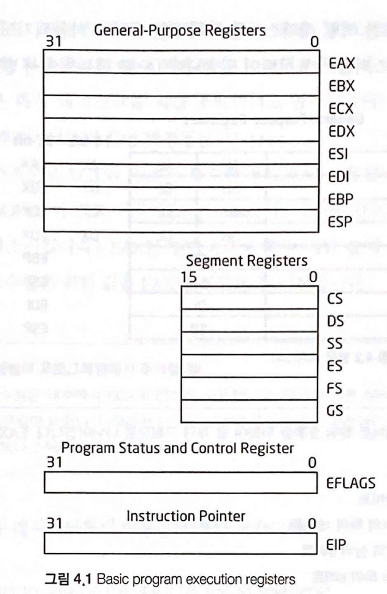

## 1부 : 기초 리버싱

### **01 리버싱 스토리**
- **리버싱(=리버스 엔지니어링, Reverse Engineering)** <br>
소프트웨어의 구조, 기능, 동작 등을 분석해 그 원리를 이해하며 단점을 보완하고 새로운 아이디어를 추가하는 일련의 작업

- **리버싱 방법**
> **정적 분석** <span style="color:red">파일을 실행하지 않고 분석</span>하는 방법, 또는 디스어셈블러를 통해 내부코드 및 구조를 확인하는 과정 <br>
> **동적 분석** <span style="color:red">파일을 직접 실행해</span>(디버깅) 코드흐름과 메모리 상태 등을 자세히 살펴보는 방법

- **소스 코드 vs 헥사 코드 vs 어셈블리 코드**
> **소스 코드** (Windows기준) 소스 코드 빌드업 시 .exe 실행파일 생성 <br>
> **헥사 코드** 디스어셈블러에서 .exe 실행파일(binary)을 16진수 hex 형식으로 변환 <br>
> **어셈블리 코드** 헥사코드를 디스어셈블 과정을 거쳐 어셈블리 코드로 변환

- **패치와 크랙**
> **패치** 프로그램의 파일 혹은 실행 중인 프로세스 메모리의 내용을 변경하는 작업 → 프로그램의 취약점 수정과 기능 개선<br>
> **크랙** 패치와 같은 개념이지만 특별히 그 의도가 비합법적이고 비도덕적인 경우 → 주로 저작권을 침해
<br>

### **02 Hello World! 리버싱**
```
//-- hello-world.cpp --//

#include <Windows.h>
#include <stdio.h>
char* str;
int main() {
  int delay = 1000;
  Sleep(delay);  // 1000ms(1초)를 대기합니다.
  str = (char*)"Hello, world!\n";
  printf(str);
  return 0;
}
```
- **디버거와 어셈블리 언어** 디버거에 탑재된 디스어셈블러는 모듈은 실행파일(binary)을 어셈블리 언어로 번역해서 보여줌

- **디버깅 목표** 어셈블리 언어로 변환된 main()함수 찾기 **[실습]()** <br>


| 디버거 관련 용어 | 내용 |
|:----------|:----------|
| **EP(Entry Point)** | Windows 실행파일(EXE, DLL, SYS 등)의 코드 시작점, 프로그램이 실행될 때 CPU에 의해 가장 먼저 실행되는 코드 시작위치 |
| **Address** |  프로세스의 가상 메모리(Virtual Address:VA) 내의 주소 |
| **Instruction** | IA32(또는 x86) CPU 명령어 |
| **Disassembled code** | OP code를 보기 쉽게 어셈블리로 변환한 코드 |
| **comment** | 디버거에서 추가한 주석 <span style="color:gray">*주석의 빨간글씨부분 ~ 코드에서 호출되는 API*</span> |
| **VA(Virtual Address** | 프로세스의 가상 메모리 |
| **OP code(OPeration code)** | CPU 명령어(바이트 code) |
| **Stub code** | 컴파일러가 프로그램을 만들 때 집어넣는 코드, 디버깅 시 사용자코드와 구분할 줄 알아야 함 |
| **PE(Portable Executable)** | Windows 실행 파일 (EXE, DLL, SYS 등) |


<br>

| 디버거 명령어(Code영역에서 동작) | 내용 |
|:----------|:----------|
| **[Ctrl+F2]** Restart | 디버깅 다시시작, 디버깅을 당하는 프로세스를 종료하고 재실행 |
| **[F7]** Step Into | 하나의 OP code 실행 (<span style="color:red">CALL 명령을 만나면, 그 함수 코드내부로 들어감</span>) |
| **[F8]** Step Over | 하나의 OP code 실행 (<span style="color:red">CALL 명령을 만나면, 코드내부로 들어가지 않고 그냥 함수자체를 실행</span>) |
| **[Ctrl+F9]** Execute till Return | 함수코드 내에서 RETN 명령어까지 실행(함수 탈출 목적) |
| **[F9]** Run | 실행 (BP가 걸려있으면 그곳에서 실행이 정지됨) |
| **Go to [Ctrl+G]** | 원하는 주소로 이동 (코드/메모리를 확인할 때 사용, 실행되는 것은 아님) |
| **[F2]** Set/Reset BP | BP 설정/해제 <span style="color:gray"> *BreakPoint*</span> |
| **[F4]** Execute till Cursor | 현재 커서까지 실행 |
| **[;]** Comment / **[:]** Label | Comment - 주석 추가, Label - 라벨 추가  |
| **[*]** Show the current EIP | 현재 EIP 위치를 보여줌 <span style="color:gray"> *Extended Instruction Pointer*</span> |
| **[-]** Show the previous Cursor | 직전 커서 위치를 다시 보여줌 |
| **[Enter]** Preview CALL/JMP address | 커서가 CALL/JMP 등의 명령어에 위치해 있다면, 해당 주소를 따라가서 보여줌 (실행되는 것이 아님, 간단히 함수 내용을 확인할 때 유용) |
| **[Ctrl+E]** Edit data | 데이터 편집 |
| **[Space]** Assemble | 어셈블리 코드 작성 |

<br>

- **베이스캠프** 디버거 특성상 재실행할 때마다 처음(EP)부터 새로 시작해야하기 때문에 상당히 불편하다. 따라서 디버깅을 진행하면서 중간 코드에서 분석을 원하는 중요 포인트(주소)를 지정해 놓은 후 그 포인트로 빠르게 갈 수 있는 방법을 기록한다.


> **베이스캠프 설치법 4가지** <br>
> **1) Go to 명령** 원하는 주소로 Go to[Ctrl+G] 후 커서이동[F4] <br>
> **2) BP 설치** BP(Break Point) 설치[F2] 후, 실행[F9] <span style="color:gray">*다만 디버거는 현재 실행위치에서부터 프로세스를 실행하다가 BP가 걸린 곳에서 멈춤*</span> <br>
> **3) 주석** [;] 단축키로 주석을 달고, 이 주석을 찾아가는 방법 <span style="color:gray">*사용자가 입력한 주석은 재실행할 때마다 불러들이기 때문에 디버깅할 때 편리함*</span> <br>
> **4) 라벨** [:] 단축키, 라벨은 원하는 주소에 특정이름을 붙이는 기능.


> **원하는 코드를 빨리 찾아내는 방법 4가지** <br>
> **1) 코드 실행** 프로그램의 기능이 명확한 경우<span style="color:gray">(*main()함수의 MessageBox()함수호출*)</span>, 명령어를 하나하나 실행하면서 원하는 위치를 찾아가는 방법. 코드의 크기가 작고 기능이 명확한 경우에 사용<br> 
> **2) 문자열 검색** <div style="text-align:center"> **PUSH 004092A0 (Text string : UNICODE "Hello World!") → 이 명령어에서 참조되는 004092A0 주소는 "Hello World!"라는 문자열** 을 의미 → Go to[Ctrl+G]로 004092A0로 이동 </div>  <br>
> **3) API 검색(1) 호출코드에 BP** 모든 모듈 관계 보기 → 프로그램의 기능을 보고 사용되었을 법한 API 호출을 예상<span style="color:gray">*(MessageBoxW() API)*</span> <br>
> **4) API 검색(2) API코드에 직접 BP** Packer/Protector를 사용해 실행파일을 압축(또는 보호)하면, 파일구조가 변경돼 API호출 목록을 볼 수 없음(3번 방법 불가) → 프로세스 메모리에 로딩된 라이브러리(DLL 코드)에 직접 BP를 걸기<div style="text-align:center"> <br>
**메모리맵 : USER32 라이브러리가 로딩되어 있는 메모리 영역**</div>

<span style="color:gray">

> ***Packer(Run Time Packer)** 실행 압축 유틸리티. 실행파이르이 코드, 데이터, 리소스 등을 압축. 일반 압축파일과 다른 점은 실행압축된 파일 그 자체도 실행파일이라는 것* <br>
> ***Protector** 실행압축 기능 외에 파일과 그 프로세스를 보호하려는 목적으로 안티디버깅, 안티이뮬레이팅, 안티덤프 등의 기능을 추가한 유틸리티*

</span>

- **"Hello World!" 문자열 패치** **[실습]()** <br>
**1) 문자열 버퍼를 직접 수정** <span style="color:gray">*but, 기존 문자열 버퍼크기 이상의 문자를 입력하면 시스템의 안전성 위협이 크기 때문에 좋은방법이 아님*</span> <br>
**2) 다른 메모리 영역에 새로운 문자열을 생성해 전달** <span style="color:gray">*만약 원본 문자열보다 더 긴 문자열로 패치해야 하는 경우 사용하는 방법. 적당한 메모리 영역(NULL padding 영역)에 패치하고자 하는 긴 문자열을 적어 놓고 주요함수에게 그 주소를 파라미터로 넘겨주기*</span>

<br>

### **03 리틀 엔디언 표기법**

- **바이트 오더링** 데이터를 저장하는 방식. 빅 엔디언(Big Endian)과 리틀 엔디언(Little Endian) 방식이 있다.

| TYPE | NAME | SIZE | 빅 엔디언 | 리틀 엔디언| 
|:----------:|:----------:|:----------:|:----------|:----------|
| BYTE | b | 1 | [12] | [12]  |
| WORD | w | 2 | [12][34] | [34][12] | 
| DWORD | dw | 4 | [12][34][56][78] | [78][56][34][12] | 
| char[ ] | str | 6 | [61][62][63][64][65][00] | [61][62][63][64][65][00] |

> *<span style="color:red">멀티 바이트(2byte 이상의 문자집합)</span>인 경우에만 <span style="color:red">리틀 엔디언 방식</span>은 각 바이트가 <span style="color:red">역순</span>으로 저장됨*

> <span style="color:gray">*char[ ] 배열의 경우 각 바이트를 하나씩 연속해서 저장하기 때문에, 리틀 엔디언에서도 문자열 자체는 빅 엔디언과 동일한 순서로 저장된다.*</span>

> <span style="color:gray">*ASCII 문자 'a'는 0x61과 같고, 'e'는 0x65와 같다. 그리고 문자열 마지막은 NULL로 끝난다.*</span>

<br>

- **빅 엔디언 & 리틀 엔디언**

| 빅 엔디언 | 리틀 엔디언| 
|:----------:|:----------:|
| 직관적 | 산술연산, 데이터의 타입이 확장/축소될 때 더 효율적 |
| RISC 계열의 CPU, 네트워크 프로토콜에서 사용 | Intel x86 CPU에서 사용 |

<br>

### **04 IA-32 Register 기본 설명**
> <span style="color:gray">***IA-32** Intel Architecture 32bit*</span>

- **CPU 레지스터란?**
레지스터(Register)란 CPU 내부에 존재하는 다목적 저장공간이며, RAM과는 성격이 다르다. CPU가 RAM에 있는 데이터를 액세스하는 데 물리적으로 멀어 시간이 오래 걸리는 것과 달리, 레지스터는 CPU 내부에 있기 때문에 고속으로 데이터를 처리할 수 있다.

- **IA-32의 레지스터**

| IA32 레지스터의 종류 |
|:----------|
| 직관적 | 
| **Basic program execution registers** |
| Control registers |
| Memory management registers |
| Debug registers |
| ... |

- **Basic program execution registers**

<div style="text-align:center"></div>

<span style="color:gray">*레지스터 이름에 E(Extended)가 붙은 경우는 예전 16비트 CPU인 IA-16시절부터 존재하던 16비터 크기의 레지스터들을 32비트 크기로 확장시켰다는 뜻이다.*</span>

**1) 범용 레지스터 *General Purpose Registers* (32비트 - 8개)** <br>

<div style="text-align:center"></div>

> 범용 레지스터 구조 <br>
EAX : <0~31> 32비트 <br>
AX : <0~15> EAX의 하위 16비트 <br>
AH : *XXX High*, <8~15> AX의 상위 8비트 <br>
AL : *XXX Low*, <0~7> AX의 하위 8비트
1) 범용 레지스터 (1) <br>
**EAX(*Extended Accumulator Register*)**
곱셈과 나눗셈 명령에서 사용되며, 함수의 반환값을 저장 <br>
**EBX(*Extended Base Register*)**
Pointer to data in the DS segment, ESI나 EDI와 결합해 인덱스에 사용됨 <br>
**ECX(*Extended Counter Register*)**
Counter for string and loop operations, 반복 명령어를 사용할 때 반복 카운터를 저장. ECX 레지스터에 반복할 횟수를 지정해 놓고 반복 작업을 수행하며 ECX를 1씩 감소시킴 <br>
**EDX(*Extended Data Register*)**
I/O pointer, EAX와 같이 사용되며 부호 확장 명령 등에 활용 <br>

> 위 4개의 레지스터는 <span style="color:red">주로 산술연산(ADD, SUB, XOR, OR 등) 명령어에서 상수/변수 값의 저장용도</span>로 많이 사용된다.

2) 범용 레지스터 (2) <br>
**ESI(*Extended Source Index*)**
source pointer for string operations, 데이터를 복사하거나 조작할 때의 소스 데이터주소가 저장됨. ESI레지스터가 가리키는 주소에 있는 데이터를 EDI 레지스터가 가리키는 주소로 복사하는 용도로 많이 사용 <br>
**EDI(*Extended Destination Index*)**
destination pointer for string operaions, 복사작업을 할 때 목적지주소가 저장되며 주로 ESI레지스터가 가리키는 주소의 데이터가 복사됨 <br>
**EBP(*Extended Base Pointer*)**
Pointer to data on the stack (in the SS segment), 하나의 스택프레임의 시작주소가 저장되며 현재 사용되는 스택프레임이 살아있는 동안 EBP의 값은 변하지 않음. 현재 사용한 스택프레임이 사라지면 이전에 사용되던 스택프레임을 가리키게 됨 <br>
**ESP(*Extended Stack Pointer*)**
Stack pointer (in the SS segment), 하나의 스택프레임의 끝 지점 주소가 저장되며 PUSH, POP 명령어에 따라서 ESP의 값이 4바이트씩 변함 <br>
<br>

> EBP, ESP 레지스터는 주로 <span style="color:red">메모리 주소를 저장하는 포인터</span>로 사용된다.

> ESI, EDI 레지스터는 <span style="color:red">메모리 복사</span>에 사용되며, 특정 명령어(LODS, STOS, REP MOVS 등)와 함께 씀

**2) 세그먼트 레지스터 *Segment Registers* (16비트 - 6개)** <br>

<div style="text-align:center">


**CS** Code Segment <br>
**SS** Stack Segment <br>
**DS** Data Segment <br>
**ES** Extra(Data) Segment <br>
**FS** Data Segment <br>
**GS** Data Segment <br>
</div>

**3) 프로그램 상태와 컨트롤 레지스터 *Program Status and Control Registers* (32비트 - 1개)** <br>

<div style="text-align:center">
</div>

**EFLAGS** Flag Register, 16비트의 FLAGS 레지스터의 32비트 확장형태이다. EFLAGS는 각각의 비트마다 의미를 갖는다. <span style="color:red">각 비트는 1 또는 0의 값을 갖는데, 이는 On/Off 혹은 True/False</span>를 의미한다. 

**Zero Flag(ZF)** 
연산 명령 후에 결과 값이 0이 되면 ZF가 1(True)로 세팅 <br>
**Overflow Flag(OF)** 
부호 있는 수(signed integer)의 오버플로가 발생했을 때 1로 세팅. 그리고 MSB(Most Significant Bit)가 변경됐을 때 1로 세팅 <br>
**Carry Flag(CF)** 
부호 없는 수(unsigned integer)의 오버플로가 발생했을 때 1로 세팅<br>

> <span style="color:gray">***ZF, OF, CF** 조건분기 명령어에서 이들 Flag의 값을 확인하고 그에 따라 동작수행 여부를 결정한다.*</span>

**4)  Instruction Pointer (32비트 - 1개)** <br>
**EIP(*Extended Instruction Pointer*)**
다음에 실행할 명령어가 저장된 메모리주소가 저장됨. 현재 명령어를 모두 실행한 다음에 EIP 레지스터에 저장된 주소에 있는 명령어를 실행함. 실행 전 EIP 레지스터에는 다음 실행해야 할 명령어가 있는 주솟값이 저장됨.

> <span style="color:gray">*CPU는 EIP에 저장된 메모리주소의 명령어(Instruction)를 하나 처리하고 난 후, 자동으로 그 명령어 길이만큼 EIP를 증가시킨다. 이런식으로 계속 명령어를 처리해 나간다. 또한 다른 범용 레지스터들과는 다르게 EIP는 그 값을 직접 변경할 수 없어 특정 명령어(JMP, Jcc, CALL, RET)를 사용하거나 인터럽트, 예외를 발생시켜야 한다.*</span>

<br>

### **05 스택**
<div style="text-align:center">

</div>

<span style="color:gray">

> ***FILO(First In Last Out)** 스택에 값을 입력(POP)하면 스택포인터(ESP)는 감소하고, 스택에서 값을 꺼내면(PUSH) 스택포인터는 증가한다*

</span>

<br>

### **06 abex` crackme #1 분석** [실습]()
<div style="text-align:center">


디버거로 분석시 EP코드가 매우 짧은 것을 알 수 있는데, abex` crackeme 파일이 어셈블리어로 만들어진 실행파일이기 때문이다. 

</div>

> *개발툴을 사용하면 자신이 사용한 소스코드 외에 컴파일러가 Stub Code를 추가시키기 때문에 디스어셈을 하면 복잡하게 보인다. 하지만 어셈블리어로 프로그램을 작성하면 어셈코드가 곧 디스어셈코드가 되기 때문에 직관적인 코드(EP에 main함수가 바로 나타남)를 확인할 수 있다.* 

- **스택에 파라미터를 전달하는 방법**

<div style="text-align:center">


주소 00401000~0040100E 사이의 명령어를 보면 MessageBoxA() 함수를 호출하기 전 4번의 PUSH명령어를 사용해 필요한 파라미터를 <span style="color:red">역순</span>으로 입력하고 있다.

</div>

위 어셈블리 코드를 C언어로 번역하면 
```
MessageBox(NULL, "Make me think your HD is a CD-Rom.", "abex` 1st crackme", MB_OK|MB_APPLMODAL);
```
실제 C언어 소스코드에서 함수에 넘기는 순서가 <span style="color:red">어셈블리 언어에서는 역순</span>이며, 스택 메모리 구조가 LIFO(*Last In First Out*)이기 때문에 <span style="color:red">파라미터를 역순으로 넣어주면</span> 받는 쪽(MessageBoxA 함수 내부)에서 올바른 순서로 꺼내 쓸 수 있는 것이다.


<div style="text-align:center">


EIP = 0040100E까지 스텝오버한 다음 스택을 보면 위 사진과 같다. <br>
MessageBoxA()함수의 첫째 파라미터(NULL)가 스택의 제일 위에 보이고, 마지막(넷째) 파라미터(MB_OK:MB_APPLMODAL)가 아래에 쌓인다.

</div>


 


