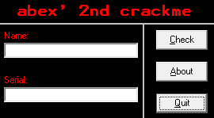

### **08 abex`crackme #2 [실습]()**

- **abex` crackme #2 실행**

Serial 키를 알아내는 프로그램으로, Name을 따로 입력받는 걸로 보아 Serial 값을 생성할 때 Name 문자열이 사용된다고 유추할 수 있다.

- **Viusal Basic 파일 특징**  
abex` crackme #2 파일은 Visual Basic으로 제작되었으므로, Visual Basic파일(VB)의 특징을 알아보자.

1) VB 전용 엔진  
VB파일은 MSVBVM60.dll(Microsoft Visual Basic Virtual Machine 6.0)이라는 **VB 전용 엔진**을 사용한다.  
ex) 메시지 박스를 출력할 땐 VB소스코드에서 MsgBox()함수를 사용한다. VB컴파일러는 실제 MSVBVM60.dll이 MsgBox()함수가 호출되도록 만들고, 이 함수 내부에서 Win32 API인 user32.dll!MessageBoxW()함수를 호출해주는 방식으로 동작한다.

2) N(Native) code, P(Pesudo) code  
VB 파일은 컴파일 옵션에 따라 N code 또는 P code로 컴파일이 가능하다. N code는 일반적인 디버거에서 해석 가능한 IA-32 Instruction을 사용하는 반면, P code는 인터프리터 언어 개념으로서 VB엔진으로 가상 머신을 구현해 자체적으로 해석 가능한 명령어(바이트 코드)를 사용하는 것이다. 따라서 VB의 P code를 정확히 해석하려면 VB 엔진을 분석해 에뮬레이터를 구현해야 한다.

3) Event Handler  
VB는 주로 GUI 프로그래밍을 할 때 사용되며, VB프로그램은 WindowsOS의 Event Driven 방식(이벤트 동작방식)으로 동작하기 때문에 **각 event handler에 사용자코드**가 존재한다. (main() 또는 WinMain()에 사용자코드가 존재하는 게 아니라)

4) undocumented 구조체  
VB에서 사용되는 각종 정보들(Dialog, Control, Form, Module, Function 등)은 내부에 구조체 형식으로 파일에 저장된다. MS에서는 이 구조체 정보를 정식으로 공개하지 않아씩 때문에 VB파일의 디버깅에 어려움이 있다.