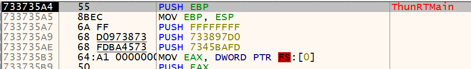

## **08 abex`crackme #2 [실습]()**

### **abex` crackme #2 실행**

Serial 키를 알아내는 프로그램으로, Name을 따로 입력받는 걸로 보아 Serial 값을 생성할 때 Name 문자열이 사용된다고 유추할 수 있다.

 

### **Viusal Basic 파일 특징** 
abex` crackme #2 파일은 Visual Basic으로 제작되었으므로, Visual Basic파일(VB)의 특징을 알아보자.

1) VB 전용 엔진  
VB파일은 MSVBVM60.dll(Microsoft Visual Basic Virtual Machine 6.0)이라는 **VB 전용 엔진**을 사용한다.  
ex) 메시지 박스를 출력할 땐 VB소스코드에서 MsgBox()함수를 사용한다. VB컴파일러는 실제 MSVBVM60.dll이 MsgBox()함수가 호출되도록 만들고, 이 함수 내부에서 Win32 API인 user32.dll!MessageBoxW()함수를 호출해주는 방식으로 동작한다.

2) N(Native) code, P(Pesudo) code  
VB 파일은 컴파일 옵션에 따라 N code 또는 P code로 컴파일이 가능하다. N code는 일반적인 디버거에서 해석 가능한 IA-32 Instruction을 사용하는 반면, P code는 인터프리터 언어 개념으로서 VB엔진으로 가상 머신을 구현해 자체적으로 해석 가능한 명령어(바이트 코드)를 사용하는 것이다. 따라서 VB의 P code를 정확히 해석하려면 VB 엔진을 분석해 에뮬레이터를 구현해야 한다.

3) Event Handler  
VB는 주로 GUI 프로그래밍을 할 때 사용되며, VB프로그램은 WindowsOS의 Event Driven 방식(이벤트 동작방식)으로 동작하기 때문에 **각 event handler에 사용자코드**가 존재한다. (main() 또는 WinMain()에 사용자코드가 존재하는 게 아니라)

4) undocumented 구조체  
VB에서 사용되는 각종 정보들(Dialog, Control, Form, Module, Function 등)은 내부에 구조체 형식으로 파일에 저장된다. MS에서는 이 구조체 정보를 정식으로 공개하지 않아씩 때문에 VB파일의 디버깅에 어려움이 있다.

5) 간접 호출 (Indirect Call)  
VC++, VB 컴파일러에서 많이 사용하는 기법으로, 중간에 다른 주소의 JMP명령을 통해 함수를 호출한다.

6) RT_MainStruct 구조체  
EP의 코드 `PUSH 401E14`의 401E14 주소에는 **ThunRTMain()함수의 파라미터인 RT_MainStruct 구조체**가 있다. RT_MainStruct구조체의 멤버는 또 다른 구조체의 주소들이다. 즉 VB엔진은 파라미터로 넘어온 RT_MainStruct 구조체를 가지고 프로그램의 실행에 필요한 모든 정보를 얻는다는 걸 알 수 있다.

  

7) ThunRTMain() 함수 구조  
ThunRTMain()의 시작주소는 733734A4로 기존 EP주소(00401238)와 완전히 달라지는 것을 볼 수 있는데, 이 주소는 MSVBVM60.dll 모듈의 **주소 영역**이기 때문이다. 즉 사용자가 작성한 코드가 아니라 VB엔진의 코드이다.

  

 

### Serial 생성 알고리즘 (with Win32 API)

1. **Name 문자열 읽기** 
2. **루프를 돌면서 문자를 암호화하기**  
주어진 Name 문자열을 앞에서부터 한 문자씩 읽기 (총 4회)  
변환된 숫자에 64를 더함  
숫자를 다시 문자로 변환  
변환된 문자를 연결

