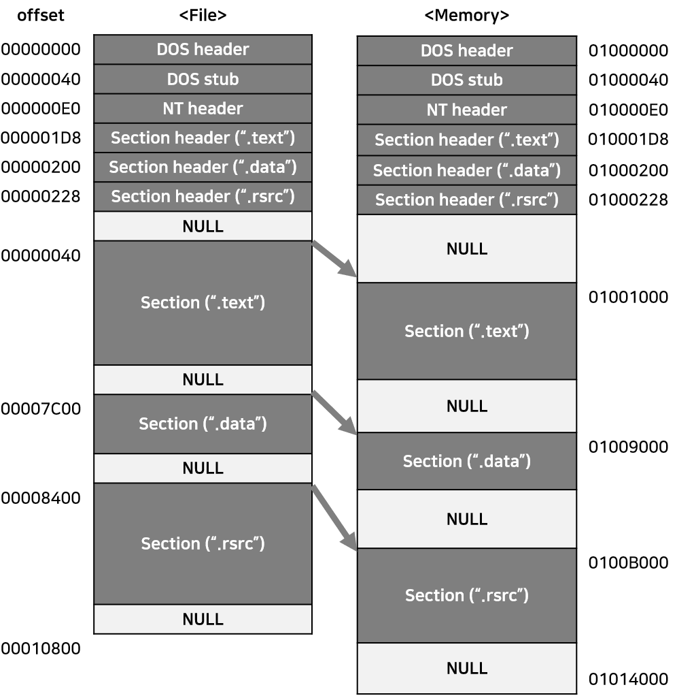
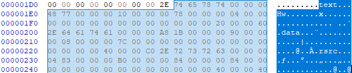
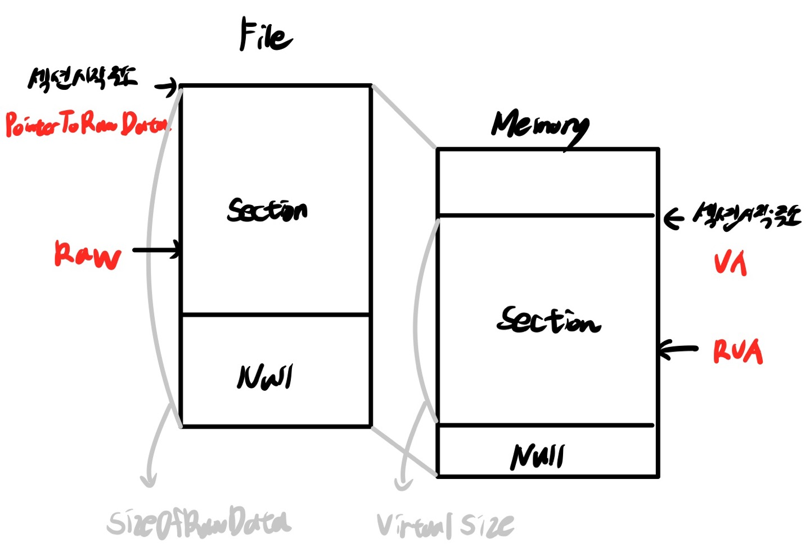

## 13 PE File Format

### PE File Format
PE(Portable Executable)파일은 Windows 운영체제에서 사용되는 **실행파일 형식**이다. <br>
PE파일은 32비트 형태의 실행파일을 의미하며 PE32라는 용어를 사용하기도 한다. 64비트 형태의 실행파일은 PE+ 또는 PE32+라고 부르며 PE파일의 확장형태이다. (PE64가 아니다) <br>

PE헤더에는 **어떻게 메모리에 적재**되고, **어디서부터 실행**되어야 하며, **실행에 필요한 DLL들**은 무엇이고, 필요한 **스택/힙 메모리의 크기**를 얼마로 할지 등 수많은 정보가 **구조체 형식**으로 저장된다. <br> <br>


|PE파일 종류|주요 확장자|
|:---:|:---:|
|실행 계열|EXE, SCR|
|라이브러리 계열|DLL, OCX, CPL, DRV|
|드라이버 계열|SYS, VXD|
|오브젝트 파일 계열|OBJ|

<br>


### 기본 구조

<div style="text-align:center">


- 위 그림과 같이 **DOS header부터 Section header까지를 PE헤더**, **그 밑의 섹션들을 합쳐서 PE바디**라고 한다.
- File에서는 offset으로, Memory에서는 VA(Virtual Address, 절대주소)로 표현한다.
- File이 Memory에 로딩되면 모양이 달라진다(섹션의 크기, 위치 등).
- 파일의 내용은 보통 **코드(.text)**, **데이터(.data)**, **리소스(.rsrc)** 섹션에 나뉘어 저장된다.
- PE헤더의 끝부분과 각 섹션의 끝에는 **Null padding**이라는 영역이 존재하는데, 파일/메모리/네트워크 패킷 등을 처리할 때 **효율을 높이기 위해 최소 기본단위 개념을 적용**했기 때문이다. File/Memory에서 섹션의 시작 위치는 각 File/Memory의 최소 기본단위의 배수에 해당하는 위치여야 하고, 빈 공간은 NULL로 채워버린다.
</div>

<br>

### VA & RVA

**VA(Virtual Address)** 프로세스 가상메모리의 절대주소 <br>
**RVA(Relative Virtual Address)** 특정 기준위치(ImageBase)에서부터의 상대주소 <br>

`RVA + ImageBase = VA`

<br>

### PE 헤더
PE 헤더는 많은 **구조체**로 이루어져 있다. 구조체의 종류와 내용은 다음과 같다. <br>

**1. DOS 헤더** <br>
모든 PE파일은 **시작 부분(e_magic)에 DOS sinature**가 있고, **e_lfanew 값은 NT Header구조체**(IMAGE_NT_HEADERS)를 가리킨다.

```
typedef struct _IMAGE_DOS_HEADER {
    WORD e_magic;    // DOS signature : 4D5A("MZ")
    ...
    LONG e_lfanew;   // offset tod NT header
} IMAGE_DOS_HEADER, *PIMAGE_DOS_HEADER;
```
<div style="text-align:center">


notepad.exe를 hex editor로 확인. 시작 2바이트는 4D5A(MZ)이며, elfanew 값은 000000E0이다(리틀엔디언 표기법). 
</div>

**2. DOS Stub** <br>
<div style="text-align:center">


notepad.exe의 DOS Stub 영역
</div>

- DOS Stub은 코드와 데이터의 혼합으로 이루어져 있다. 
- 밑줄 친 40~4D 영역은 16비트 어셈블리 명령어이다. (DOS환경에서만 실행됨)

**3. NT 헤더** <br>
NT 헤더의 구조체 IMAGE_NT_HEADERS 이다.
```
typedef struct _IMAGE_NT_HEADERS {
    DWORD Signature;       // PE Signature : 50450000 ("PE"00)
    IMAGE_FILE_HEADER FileHeader;
    IMAGE_OPTIONAL_HEADER32 OptionalHeader;
} IMAGE_NT_HEADERS32, *PIMAGE_NT_HEADERS32;
```

**4. NT 헤더 - File Header** <br>
IMAGE_FILE_HEADER 구조체이다. 파일의 개략적인 속성을 나타낸다.
```
typedef struct _IMAGE_FILE_HEADER {
    WORD Machine;            // *중요
    WORD NumberOfSections;    // *중요
    DWORD TimeDateStamp;
    DWORD PointerToSymbolTable;
    DWORD NumberOfSymbols;
    WORD SizeOfOptionalHeader;    // *중요
    WORD Characteristics;         // *중요
} IMAGE_FILE_HEADER, *PIMAGE_FILE_HEADER;
```
  1. **Machine** 멤버 <br>
  Machine 넘버는 CPU별로 고유한 값이며 32비트 Intel x86 호환 칩은 14C의 값을 갖는다.
  2. **NumberOfSections** 멤버 <br>
  PE파일은 코드, 데이터, 리소스 등 각 섹션이 나뉘어서 저장되는데, NumberOfSections는 각 섹션의 개수(>0, *정의된 섹션 개수와 실제 섹션이 다르면 실행 에러 발생*)를 나타낸다. 
  3. **SizeOfOptionalHeader** 멤버 <br>
  SizeOfOptionalHeader 멤버는 IMAGE_NT_HEADERS 구조체의 마지막 멤버, IMAGE_OPTIONAL_HEADER32 구조체의 크기를 나타낸다. Windows의 PE로더는 SizeOfOptionalHeader 값을 보고 구조체의 크기를 인식한다(32-bit, 64-bit에 따라 구조체의 크기가 달라지기 때문). 
  4. **Characteristics** 멤버 <br>
  파일의 속성을 나타내는 값으로, 실행이 가능한 형태(executable or not)인지 DLL 파일인지 등의 정보들이 bit OR 형식으로 조합된다. 

**5. NT 헤더 - Optional Header** <br>
PE헤더 구조체 중에서 가장 크기가 큰 IMAGE_OPTIONAL_HEADER32 이다.
```
typedef struct _IMAGE_DATA_DIRECTORY {
    DOWRD VirtualAddress;
    DOWRD Size;
} IMAGE_DATA_DIRECTORY, *PIMAGE_DATA_DIRECTORY;

#define IMAGE_NUMBEROF_DIRECTORY_ENTRIES 16

typedef struct _IMAGE_IPTIONAL_HEADER {
    WORD Magic;
    ...
    DWORD AddressOfEntryPoint;
    ...
    DWORD ImageBase;
    DWORD SectionAlignment;
    DWORD FileAlignment;
    ...
    DWORD SizeOfImage;
    DWORD SizeOfHeaders;
    ...
    WORD Subsystem;
    ...
    DWORD NumberOfRvaAndSizes;
    IMAGE_DATA_DIRECTORY DataDirectory[IMAGE-NUMBEROF_DIRECTORY_ENTRIES];
} IMAGE_IPTIONAL_HEADER32, *PIMAGE_IPTIONAL_HEADER32;
```

1. **Magic** 멤버 <br>
Magic 넘버는 IMAGE_OPTIONAL_HEADER32 구조체인 경우 10B, IMAGE_OPTIONAL_HEADER64 구조체인 경우 20B 값을 갖는다.

2. **AddressOfEntryPoint** 멤버 <br>
AddressOfEntryPoint멤버는 **EP의 RVA값**을 가지며, 이 값이 프로그램에서 최초로 실행되는 코드의 시작 주소이다.

3. **ImageBase** 멤버 <br>
프로세스의 가상메모리는 32비트의 경우 0~FFFFFFFF 범위이며, **ImageBase는 이 메모리에서 PE파일이 로딩되는 시작 주소**를 나타낸다. <br>
EXE, DLL 파일은 user memory 영역인 0~7FFFFFFF 범위에 로딩되고, SYS 파일은 kernel emory 영역인 80000000~FFFFFFFF 범위에 로딩된다. <br>
일반적으로 개발 도구들이 만들어내는 **EXE파일의 ImageBase값은 00400000**이고, **DLL 파일의 ImageBase값은 10000000**이다. <br>
PE로더는 PE파일을 실행시키기 위해 프로세스를 생성하고 파일을 메모리에 로딩한 후, **EIP 레지스터 값을 ImageBase + AddressOfEntryPoint값으로** 세팅한다. 

4. **SectionAlignment, FileAlignment** 멤버 <br>
PE파일의 바디 부분은 섹션으로 나뉘는데, **파일에서 섹션의 최소단위는 FileAlginment**가, **메모리에서 섹션의 최소단위는 SectionAlignment**이다. 파일/메모리의 섹션크기는 반드시 각각 FileAlignment/SectionAlignment의 배수여야한다.

5. **SizeOfImage** 멤버 <br>
SizeOfImage는 PE파일이 메모리에 로딩되었을 때 **가상메모리에서 PE Image가 차지하는 크기**를 나타낸다. 

6. **SizeOfHeader** 멤버 <br>
SizeOfHeader는 PE헤더의 전체 크기를 나타낸다. 이 값 역시 FileAlignment의 배수여야한다. 

7. **Subsystem** 멤버
Subsystem의 값에 따라 파일의 종류를 구분할 수 있다. 

값|의미
:---:|:---:
1|시스템 드라이버 파일 (*.sys)
2|GUI 파일 (Graphic User Interface, 일반실행파일) (*.exe)
3|CUI 파일 (Console User Interface, 콘솔기반파일) (*.exe)

8. **NumberOfRvaAndSizes** 멤버 <br>
NumberOfRvaAndSizes멤버는 IMAGE_OPTIONAL_HEADER32 구조체의 마지막 멤버인 DataDirectory 배열의 개수를 나타낸다. PE로더는 NORAS의 값을 보고 배열의 크기를 인식한다.

9. **DataDirectory** 멤버 <br>
DataDirectory멤버는 IMAGE_DATA_DIRECTORY 구조체의 배열로, 배열의 각 항목마다 정의된 값을 갖는다. (EXPORT, IMPORT Directory 구조 등)

**6. 섹션 헤더** <br>
PE파일은 code, data, resource 등을 각 섹션으로 나누어 저장하며, 각 섹션 헤더에는 섹션의 속성이 정의되어 있다. 섹션의 속성에는 파일/메모리에서의 시작위치, 크기, 액세스 권한 등이 있다. 

종류|메모리 속성별 액세스 권한
:---:|:---:
code|실행, 읽기 권한
data|비실행, 읽기, 쓰기 권한
resource|비실행, 읽기 권한

**# IMGAE_SECTION_HEADER** <br>
섹션 헤더는 각 섹션별 IMAGE_SECTION_HEADER 구조체의 배열로 되어있다. 다음은 IMAGE_SECTION_HEADER 중 구조체의 중요 멤버에 대해 나열하였다.

```
#define IMAGE_SIEZEOF_SHORT_NAME 8

typedef struct _IMAGE_SECTION_HEADER {
    BYTE Name[IMAGE_SIZEOF_SHORT_NAME];  // PE스페엔 섹션Name에 대한 명시적인 규칙이 없기 때문에, 섹션의 Name은 그냥 참고용이다.
    union {
        DWORD PhysicalAddress;
        DWORD VirtualSize;  //  메모리에서 섹션이 차지하는 크기
    } Misc;
    DWORD VirtualAddress;   //  메모리에서 섹션의 시작 주소(RVA)
    DWORD SizeOfRawData;    //  파일에서 섹션이 차지하는 크기
    DOWRD PointerToRawData; //  파일에서 섹션의 시작 위치
    ...
    DOWRD Characteristics;  //  섹션의 속성(bit OR)
} IMAGE_SECTION_HEADER, *PIMAGE_SECTION_HEADER;
```

다음은 실제 notepad.exe의 섹션 헤더 배열(text/data/rsrc)이다.
<div style="text-align:center"></div>

### RVA to RAW
PE파일이 메모리에 로딩되었을 때 각 섹션에서 **메모리의 주소**(***RVA***)와 **파일 오프셋**(*파일의 시작점부터 현재 커서의 위치가지 얼마나 떨어져있는지 보여주는 **정수값***)을 매핑한다. 이러한 매핑을 'RVA to RAW'라고 칭한다. <br>
**(1) RVA가 속해 있는 섹션을 찾은 후**, **(2) 간단한 비례식을 사용해 파일 옵셋(RAW)을 계산**한다. 비례식은 다음과 같다.

`RAW - PointerToRawData = RVA - VirtualAddress`

`RAW = RVA - VirtualAddress + PointerToRawData`

- <span style="color:gray">*참고*<br></span> 

`SizeOfRawData : 파일에서 섹션이 차지하는 크기로, Null패딩 크기를 포함한 File Alignment의 배수다.` <br>
`Virtual Size : 메모리에서 차지할 섹션의 실제 크기 (Null 패딩 포함 X)` <br>
`VA : 메모리에서 섹션의 상대적인 시작주소(=섹션헤더 구조체의 멤버 이름)` <br>
`PointerToRawData : 파일에서 섹션의 시작 오프셋` <br>
`RAW : 파일에서 찾고자 하는 어떤 데이터의 오프셋` <br>
`RVA : 메모리에서 찾고자 하는 어떤 데이터의 오프셋`

Q1. RVA = 5000일 때 File Offset 값은? <br>
A1. RVA=5000은 첫 번째 섹션(.text)에 속해있으므로(ImageBase=01000000), <br>
`RAW = 5000(RVA) - 1000(VA, Memory-text섹션 시작주소) + 400(PointerToRawData, File-text섹션 시작주소)` 이다.

Q2. RVA = 13314일 때 File Offset 값은? <br>
A2. `RAW = 13314 (RVA) - B000 (VA, Memory-rsrc 섹션 시작주소) + 8400(PointerToRawData, File-rsrc 섹션 시작주소)` 이다.

Q3. RVA = ABA8일 때 File Offset 값은? <br>
A3. `RAW = ABA8 (RVA) - 9000 (VA, Memory-data 섹션 시작주소) + 7C00(PointerToRawData, File-data 섹션 시작주소)` 이다.


 
