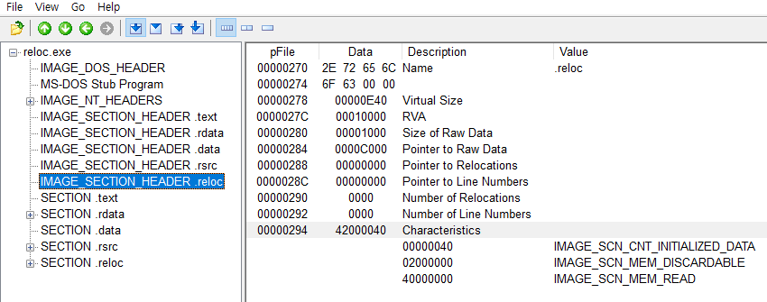

## 실행파일에서 .reloc 섹션 제거하기 

### .reloc 섹션
VC++에서 생성된 PE파일의 Relocation 섹션 이름은 '.reloc'이다. .reloc섹션이 제거되면 PE파일 크기가 약간 줄어드는 효과를 볼 수 있다. .reloc 섹션은 보통 마지막에 위치하며, PEView와 Hex editor만 가지고도 수동으로 제거할 수 있다.

### reloc.exe
'.reloc' 섹션을 정확히 제거하려면 다음과 같은 네 단계의 작업을 해야 한다.  

1. **.reloc 섹션 헤더 정리**
2. **.reloc 섹션 제거**
3. **IMAGE_FILE_HEADER 수정**
4. **IMAGE_OPTIONAL_HEADER 수정**

### 1. .reloc 섹션 헤더 정리
.reloc 섹션 헤더는 파일 옵셋 270부터 시작된다. 따라서 270~297 부분을 Hex Editor를 이용해 0으로 덮어 쓴다.  

### 2. .reloc 섹션 제거
.reloc 섹션의 옵셋은 C000~끝까지 이며, 이 부분을 Hex Editor로 삭제한다.  
이로써 .reloc 섹션은 물리적으로 제거되었으나, 다른 PE헤더 정보들이 수정되지 않아 파일이 정상적으로 실행되지 않는다.  

### 3. IMAGE_FILE_HEADER 수정 
섹션을 하나 제거했으니 IMAGE_FILE_HEADER - Number Of Sections 항목을 수정해야 한다. Number Of Sections 항목의 값은 현재 5인데, 섹션이 하나 줄었으므로 4로 바꾼다.  
  

### 4. IMAGE_OPTIONAL_HEADER 수정
.rlloc 섹션이 제거되면서, 프로세스 가상메모리에서 섹션 크기만큼 전체 이미지 크기가 줄어들었다. 이미지 크기는 IMAGE_OPTIONAL_HEADER -SIze of Image 값에 명시되므로 이를 수정해야 한다.  
  
현재 Size of Image 값은 11000이다. 얼마만큼 값을 빼는지가 관건인데, .reloc 섹션의 VirtualSize 값은 E40이고, 이를 Section Alignment에 맞게 확장하면 1000이 된다. 따라서 Size of Image 값을 1000만큼 빼야 한다.

