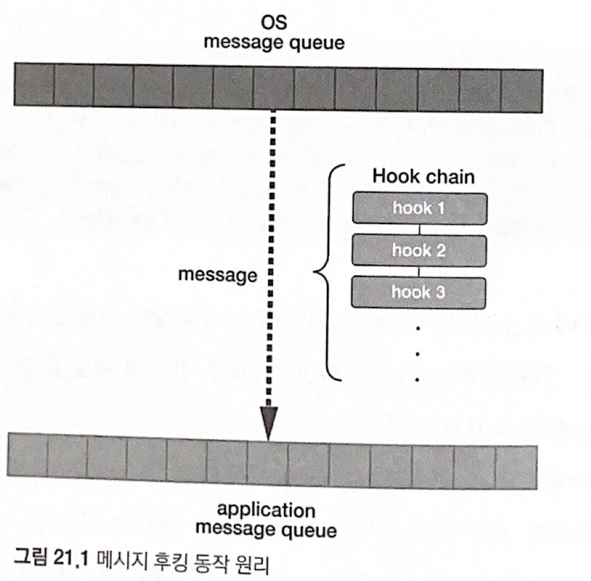
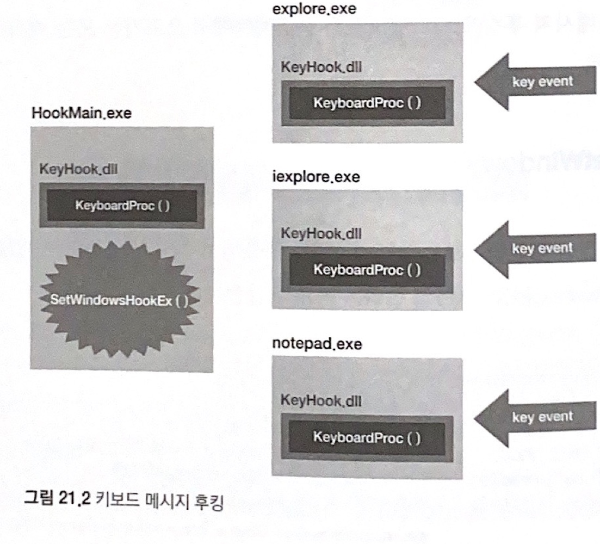

## Windows 메시지 후킹 [실습](https://waeandway.tistory.com/entry/%EB%A6%AC%EB%B2%84%EC%8B%B1%ED%95%B5%EC%8B%AC%EC%9B%90%EB%A6%AC-Windows-%EB%A9%94%EC%8B%9C%EC%A7%80-%ED%9B%84%ED%82%B9)

### 메시지 훅
- **훅(Hook)**  
`중간에서 오고가는 정보를 엿보거나 가로채기 위해 초소를 설치하는 행위`

- **후킹(Hooking)**  
`실제 정보를 엿보고 조작하는 행위`

Windows OS는 **GUI**를 제공하고, 이는 **Event Driven**방식으로 동작한다. 이벤트가 발생할 때 OS는 미리 정의된 메시지를 해당 응용 프로그램으로 통보한다. **응용 프로그램은 해당 메시지를 분석해 필요한 작업을 진행**하는 것이다. 즉 키보드를 입력할 때에도 OS로부터 응용 프로그램으로 메시지가 이동한다. **메시지 훅이란 바로 이런 메시지를 중간에서 엿보는 것**이다.

 

 

