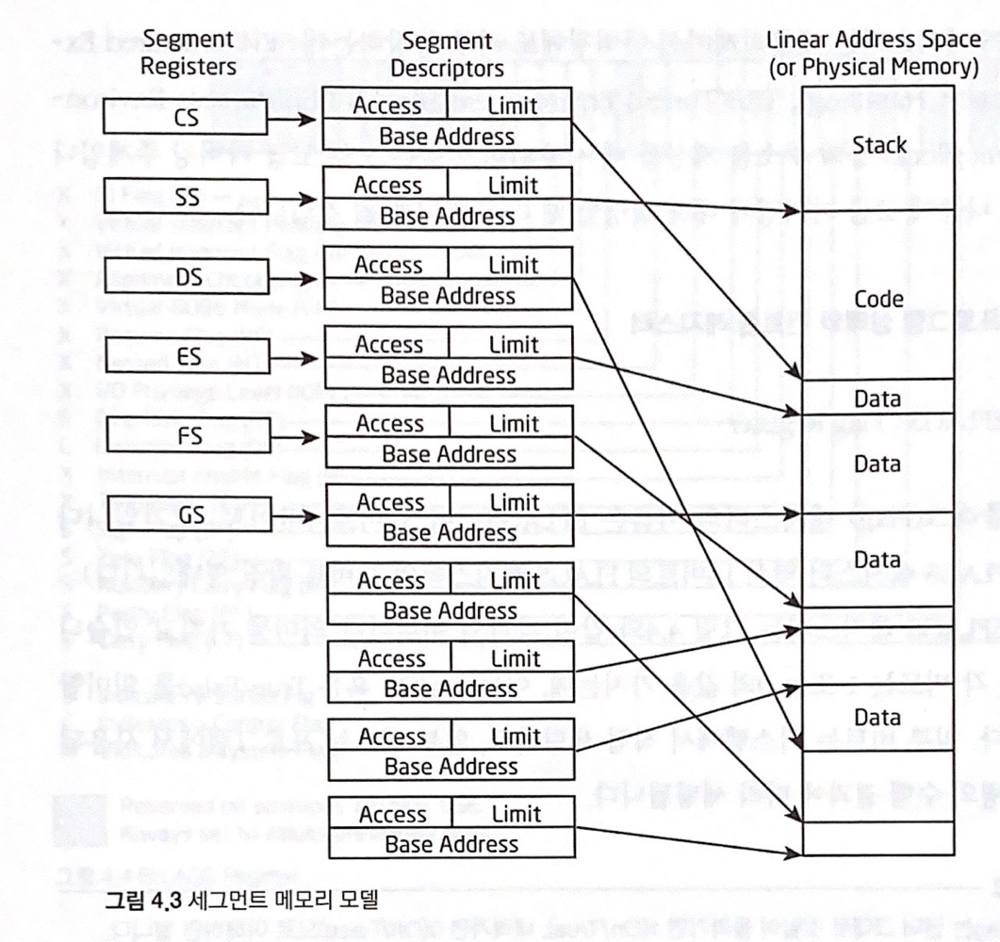
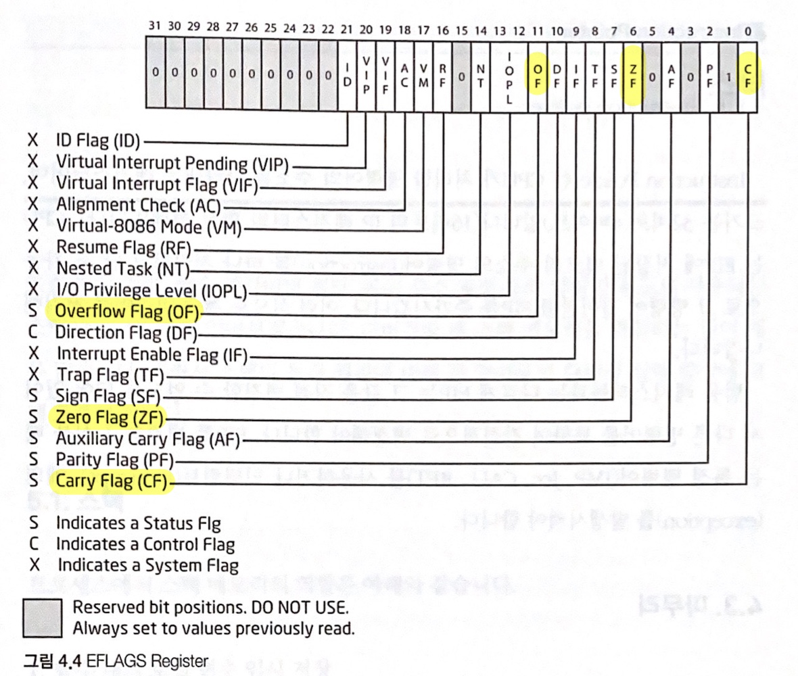

### **04 IA-32 Register 기본 설명**
> ***IA-32** Intel Architecture 32bit*

- **CPU 레지스터란?**
레지스터(Register)란 CPU 내부에 존재하는 다목적 저장공간이며, RAM과는 성격이 다르다. CPU가 RAM에 있는 데이터를 액세스하는 데 물리적으로 멀어 시간이 오래 걸리는 것과 달리, 레지스터는 CPU 내부에 있기 때문에 고속으로 데이터를 처리할 수 있다.

- **IA-32의 레지스터**

| IA32 레지스터의 종류 |
|:----------|
| 직관적 | 
| **Basic program execution registers** |
| Control registers |
| Memory management registers |
| Debug registers |
| ... |

- **Basic program execution registers**

*레지스터 이름에 E(Extended)가 붙은 경우는 예전 16비트 CPU인 IA-16시절부터 존재하던 16비터 크기의 레지스터들을 32비트 크기로 확장시켰다는 뜻이다.*

**1) 범용 레지스터 *General Purpose Registers* (32비트 - 8개)**  

> 범용 레지스터 구조  
EAX : <0~31> 32비트  
AX : <0~15> EAX의 하위 16비트  
AH : *XXX High*, <8~15> AX의 상위 8비트  
AL : *XXX Low*, <0~7> AX의 하위 8비트
1) 범용 레지스터 (1)  
**EAX(*Extended Accumulator Register*)**
곱셈과 나눗셈 명령에서 사용되며, 함수의 반환값을 저장  
**EBX(*Extended Base Register*)**
Pointer to data in the DS segment, ESI나 EDI와 결합해 인덱스에 사용됨  
**ECX(*Extended Counter Register*)**
Counter for string and loop operations, 반복 명령어를 사용할 때 반복 카운터를 저장. ECX 레지스터에 반복할 횟수를 지정해 놓고 반복 작업을 수행하며 ECX를 1씩 감소시킴  
**EDX(*Extended Data Register*)**
I/O pointer, EAX와 같이 사용되며 부호 확장 명령 등에 활용  

> 위 4개의 레지스터는 주로 산술연산(ADD, SUB, XOR, OR 등) 명령어에서 상수/변수 값의 저장용도로 많이 사용된다.

2) 범용 레지스터 (2)  
**ESI(*Extended Source Index*)**
source pointer for string operations, 데이터를 복사하거나 조작할 때의 소스 데이터주소가 저장됨. ESI레지스터가 가리키는 주소에 있는 데이터를 EDI 레지스터가 가리키는 주소로 복사하는 용도로 많이 사용  
**EDI(*Extended Destination Index*)**
destination pointer for string operaions, 복사작업을 할 때 목적지주소가 저장되며 주로 ESI레지스터가 가리키는 주소의 데이터가 복사됨  
**EBP(*Extended Base Pointer*)**
Pointer to data on the stack (in the SS segment), 하나의 스택프레임의 시작주소가 저장되며 현재 사용되는 스택프레임이 살아있는 동안 EBP의 값은 변하지 않음. 현재 사용한 스택프레임이 사라지면 이전에 사용되던 스택프레임을 가리키게 됨  
**ESP(*Extended Stack Pointer*)**
Stack pointer (in the SS segment), 하나의 스택프레임의 끝 지점 주소가 저장되며 PUSH, POP 명령어에 따라서 ESP의 값이 4바이트씩 변함  
 

> EBP, ESP 레지스터는 주로 메모리 주소를 저장하는 포인터로 사용된다.

> ESI, EDI 레지스터는 메모리 복사에 사용되며, 특정 명령어(LODS, STOS, REP MOVS 등)와 함께 씀

**2) 세그먼트 레지스터 *Segment Registers* (16비트 - 6개)**  

**CS** Code Segment  
**SS** Stack Segment  
**DS** Data Segment  
**ES** Extra(Data) Segment  
**FS** Data Segment  
**GS** Data Segment  

**3) 프로그램 상태와 컨트롤 레지스터 *Program Status and Control Registers* (32비트 - 1개)**  

**EFLAGS** Flag Register, 16비트의 FLAGS 레지스터의 32비트 확장형태이다. EFLAGS는 각각의 비트마다 의미를 갖는다. 각 비트는 1 또는 0의 값을 갖는데, 이는 On/Off 혹은 True/False를 의미한다. 

**Zero Flag(ZF)** 
연산 명령 후에 결과 값이 0이 되면 ZF가 1(True)로 세팅  
**Overflow Flag(OF)** 
부호 있는 수(signed integer)의 오버플로가 발생했을 때 1로 세팅. 그리고 MSB(Most Significant Bit)가 변경됐을 때 1로 세팅  
**Carry Flag(CF)** 
부호 없는 수(unsigned integer)의 오버플로가 발생했을 때 1로 세팅 

> ***ZF, OF, CF** 조건분기 명령어에서 이들 Flag의 값을 확인하고 그에 따라 동작수행 여부를 결정한다.*

**4)  Instruction Pointer (32비트 - 1개)**  
**EIP(*Extended Instruction Pointer*)**
다음에 실행할 명령어가 저장된 메모리주소가 저장됨. 현재 명령어를 모두 실행한 다음에 EIP 레지스터에 저장된 주소에 있는 명령어를 실행함. 실행 전 EIP 레지스터에는 다음 실행해야 할 명령어가 있는 주솟값이 저장됨.

> *CPU는 EIP에 저장된 메모리주소의 명령어(Instruction)를 하나 처리하고 난 후, 자동으로 그 명령어 길이만큼 EIP를 증가시킨다. 이런식으로 계속 명령어를 처리해 나간다. 또한 다른 범용 레지스터들과는 다르게 EIP는 그 값을 직접 변경할 수 없어 특정 명령어(JMP, Jcc, CALL, RET)를 사용하거나 인터럽트, 예외를 발생시켜야 한다.*