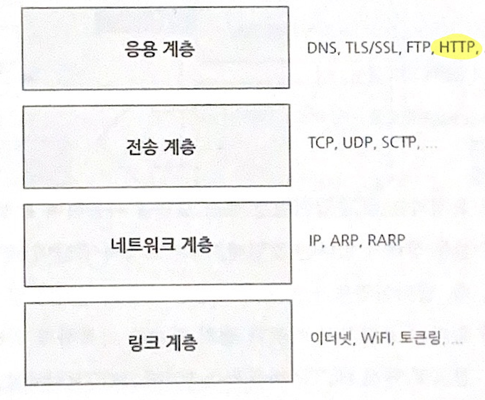

## 01 웹 해킹 개요

### **1. 웹의 개념**
웹(*World Wide Web, WWW*)은 네트워크 기술의 한 분야로 가장 거대한 네트워크이다. 또한 인터넷에서 HTTP 프로토콜, 하이퍼텍스트, HTML 형식 등을 사용해 그림과 문자를 교환하는 전송방식을 말하기도 한다.

### **2. 웹의 구조**
**2. 1 하이퍼텍스트** 
HTML(Hyper Text Markup Language) : 웹 문서를 만들기 위한 언어

**2. 2 HTTP (*Hyper TexT Protocol*)** 

**TCP/IP 계층구조**

- **HTTP의 특징**  
1. 요청(Request)과 응답(Response)을 통한 통신 구조
2. 항상 클라이언트의 요청에 의해 통신 시작
3. 상태가 없는(Stateless) 프로토콜

> *'상태가 없다'(Stateless)* : *Only HTTP 1.0, 요청과 응답이 과거의 상태내용을 모름을 의미한다. 이러한 웹의 한계를 극복하기 위해 쿠키나 세션 등의 기술의 쓴다.*

- **HTTP의 메서드**

|메서드|설명|
|:---|:---|
|**GET**|서버에 자원을 요청함. 요청내용이 보이고 데이터는 4.096바이트로 제한됨|
|**POST**|서버에 데이터를 전송. GET과 달리 내용이 보이지 않음|
|**HEAD**|본문(body)의 헤더정보만 얻음|
|**PUT**|서버에 자원을 생성|
|**TRACE**|요청사항을 다시 얻음. 클라이언트가 'host:www.test.com'을 요청하면 그대로 반환된 'host:www.test.com'문자열을 얻음. 일종의 LoopBack 테스트|
|**OPTIONS**|응답 가능한 메서드들을 요청|
|**DELETE**|서버의 자원을 삭제|

> *PUT, DELETE를 통해 악성코드 등을 쉽게 업로드하거나 주요자원을 삭제할 수 있고, TRACE와 OPTIONS는 서버의 보안취약점을 알 수 있는 정보를 제공하므로 보안상 치명적이다.*

- **HTTP의 상태 코드**

|상태 코드|내용|
|:---|:---|
|**1XX**|일반 정보|
|**2XX**|정상처리|
|**3XX**|Redirection|
|**4XX**|Client Error|
|**5XX**|Sever Error|

